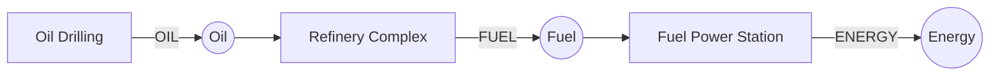
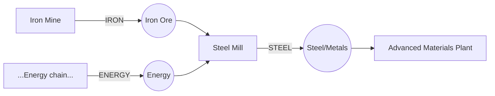

# EARTH Economy Audit

[← Documentation home](wiki/Home.md) · [Codebase audit](CODEBASE_AUDIT.md)

Every figure and every table row below was produced by parsing the technology
source files directly (`app/src/main/java/com/earthgame/idle/domain/technologies/
*Technologies.kt`) with a from-scratch, paren-balanced Python parser — not by
reading `domain/production/ProductionGraph.kt`'s own derived data, and not by
trusting the prior PR's own description of itself. Where the independent
parse and the shipped `EconomyValidationTest` assertions agree, that is noted.

## Summary counts

| | Count |
| :-- | --: |
| Total technologies | 157 |
| Producers (`GENERATOR`) | 78 |
| Consumers (`CONSUMER`) | 26 |
| Multipliers | 28 |
| Unlocks | 23 |
| Choices | 2 |
| Resources | 15 |
| Branches | 16 |
| Resource-to-resource cycles | 8 (all anchored — see below) |
| Resources with no producer | 0 |
| Resources with no consumer | 2 (`RESEARCH`, `CONCRETE` — both documented dead ends) |
| Consumers whose output exceeds input at rated capacity | 0 |
| Duplicate technology IDs | 0 |

## Producers (78)

| Tier | ID | Branch | Outputs | Requires |
| :-- | :-- | :-- | :-- | :-- |
| 0 | `natural_fire` | Primitive | ENERGY | — |
| 1 | `controlled_fire` | Primitive | ENERGY, RESEARCH | `natural_fire` |
| 3 | `charcoal` | Primitive | ENERGY, COAL | `cooking` |
| 5 | `bronze` | Primitive | ENERGY, STEEL | `metalworking` |
| 6 | `iron` | Primitive | ENERGY, STEEL | `bronze` |
| 7 | `farming` | Agriculture | ENERGY, RESEARCH | `early_agriculture` |
| 8 | `animal_domestication` | Agriculture | ENERGY, RESEARCH | `farming` |
| 8 | `horse_and_cart` | Transportation | RESEARCH | `early_agriculture` |
| 9 | `coal_mining` | Industry | COAL | `steam_engine` |
| 9 | `oil_drilling` | Fossil_Fuels | OIL | `steam_engine` |
| 9 | `generator_dynamo` | Electricity | ENERGY | `steam_engine` |
| 9 | `iron_mining` | Mining | IRON | `surface_prospecting` |
| 10 | `rice_cultivation` | Agriculture | *gas only:* CH4, N2O | `irrigation` |
| 10 | `steam_vehicle` | Transportation | ENERGY | `steam_engine` |
| 10 | `steam_locomotive` | Industry | ENERGY | `coal_mining` |
| 10 | `oil_refinery` | Fossil_Fuels | ENERGY | `oil_drilling` |
| 11 | `livestock` | Agriculture | ENERGY | `animal_domestication` |
| 11 | `factories` | Industry | ENERGY | `steam_engine` |
| 11 | `coal_power_plant` | Electricity | ENERGY | `generator_dynamo`, `coal_mining` |
| 11 | `copper_mining` | Mining | COPPER | `iron_mining` |
| 11 | `concrete` | Construction | CONCRETE | `cement_production` |
| 12 | `automobile` | Transportation | ENERGY | `oil_refinery` |
| 12 | `steel_production` | Industry | STEEL | `coal_mining`, `iron` |
| 12 | `cement_production` | Industry | CONCRETE | `factories` |
| 12 | `natural_gas` | Fossil_Fuels | ENERGY | `oil_drilling` |
| 12 | `ammonia` | Chemistry | ENERGY | `industrial_chemistry` |
| 13 | `synthetic_fertilizer` | Agriculture | RESEARCH | `fertilizer`, `ammonia` |
| 13 | `mass_production_cars` | Transportation | ENERGY | `automobile`, `factories` |
| 13 | `diesel_engine` | Transportation | ENERGY | `oil_refinery` |
| 13 | `industrial_furnaces` | Industry | STEEL | `steel_production` |
| 13 | `hydroelectricity` | Electricity | ENERGY | `grid_electricity` |
| 13 | `gas_turbine` | Electricity | ENERGY | `grid_electricity` |
| 13 | `steel_buildings` | Construction | ENERGY | `steel_production`, `concrete` |
| 14 | `trucks` | Transportation | ENERGY | `diesel_engine` |
| 14 | `fracking` | Fossil_Fuels | OIL | `natural_gas` |
| 14 | `open_pit_mining` | Mining | IRON, COPPER | `mechanised_mining` |
| 14 | `refrigeration` | Chemistry | ENERGY | `ammonia` |
| 15 | `mega_farms` | Agriculture | ENERGY | `industrial_agriculture` |
| 15 | `jet_aircraft` | Transportation | ENERGY | `diesel_engine`, `petrochemicals` |
| 15 | `offshore_drilling` | Fossil_Fuels | OIL | `oil_refinery` |
| 15 | `nuclear_power` | Electricity | ENERGY | `grid_electricity` |
| 15 | `skyscrapers` | Construction | ENERGY | `steel_buildings` |
| 16 | `factory_farming` | Agriculture | ENERGY | `mega_farms` |
| 16 | `geothermal_plant` | Electricity | ENERGY | `grid_electricity`, `open_pit_mining` |
| 16 | `commercial_aviation` | Transportation | ENERGY | `jet_aircraft` |
| 16 | `container_ships` | Transportation | ENERGY | `oil_refinery` |
| 16 | `oil_sands` | Fossil_Fuels | OIL | `offshore_drilling` |
| 16 | `supercritical_coal` | Electricity | ENERGY | `coal_power_plant` |
| 16 | `combined_cycle_gas` | Electricity | ENERGY | `gas_turbine` |
| 16 | `cfcs` | Chemistry | *gas only:* FLUORINATED | `refrigeration` |
| 16 | `airports` | Construction | ENERGY | `concrete`, `commercial_aviation` |
| 17 | `coal_mega_mining` | Fossil_Fuels | COAL | `coal_mining`, `oil_sands` |
| 17 | `uranium_mining` | Mining | URANIUM | `uranium_prospecting` |
| 17 | `megacities` | Construction | ENERGY | `skyscrapers` |
| 18 | `containerization` | Globalization | ENERGY | `international_trade` |
| 18 | `rare_earth_mining` | Mining | RARE_EARTHS | `rare_earth_processing` |
| 18 | `hfcs` | Chemistry | *gas only:* FLUORINATED | `cfcs` |
| 19 | `wind_farm` | Electricity | ENERGY | `rare_earth_mining`, `grid_electricity` |
| 19 | `supersonic_aviation` | Transportation | ENERGY | `commercial_aviation` |
| 20 | `consumer_economy` | Globalization | ENERGY | `global_supply_chains` |
| 20 | `in_situ_leaching` | Mining | URANIUM, COPPER | `rare_earth_mining`, `petrochemicals` |
| 20 | `industrial_fluorinated_gases` | Chemistry | *gas only:* FLUORINATED | `hfcs` |
| 21 | `global_aviation_networks` | Globalization | ENERGY | `commercial_aviation` |
| 22 | `solar_farm` | Electricity | ENERGY | `wind_farm`, `integrated_circuits` |
| 22 | `247_manufacturing` | Globalization | ENERGY | `consumer_economy` |
| 23 | `data_centers` | Digital | RESEARCH | `internet` |
| 23 | `deep_sea_mining` | Mining | RARE_EARTHS, IRON | `in_situ_leaching`, `containerization` |
| 24 | `cloud_computing` | Digital | RESEARCH | `data_centers` |
| 25 | `ai` | Digital | RESEARCH | `cloud_computing` |
| 26 | `mass_ai_infrastructure` | Digital | RESEARCH, ENERGY | `ai` |
| 29 | `fusion_power` | Endgame | ENERGY, RESEARCH | `advanced_manufacturing` |
| 30 | `orbital_industry` | Endgame | ENERGY | `fusion_power` |
| 32 | `moon_mining` | Endgame | STEEL, CONCRETE | `space_elevator` |
| 33 | `asteroid_capture` | Endgame | STEEL, ENERGY | `moon_mining` |
| 34 | `planetary_industry` | Endgame | ENERGY | `asteroid_capture` |
| 35 | `terraforming_engines` | Endgame | ENERGY | `planetary_industry` |
| 36 | `dyson_swarm_prototype` | Endgame | ENERGY | `terraforming_engines` |
| 37 | `matrioshka_brain` | Endgame | ENERGY, RESEARCH | `dyson_swarm_prototype` |

4 of the 78 producers make no `ResourceId` at all — they exist purely to
emit or remove a greenhouse gas (`rice_cultivation`, `cfcs`, `hfcs`,
`industrial_fluorinated_gases`). This is intentional (they model real-world
emission sources that matter to the climate simulation, not the resource
economy) but means "producer" here is slightly broader than "resource
producer."

## Consumers (26)

| Tier | ID | Branch | Inputs | Outputs | Requires |
| :-- | :-- | :-- | :-- | :-- | :-- |
| 12 | `coal_fired_station` | Electricity | COAL | ENERGY | `coal_power_plant` |
| 12 | `refinery_complex` | Fossil_Fuels | OIL | FUEL | `fractional_distillation` |
| 13 | `steel_mill` | Materials | IRON, ENERGY | STEEL | `blast_furnace_practice` |
| 14 | `petrochemical_plant` | Chemistry | OIL, ENERGY | CHEMICALS | `refinery_complex`, `petrochemicals` |
| 14 | `industrial_cement_kiln` | Materials | COAL, ENERGY | CONCRETE | `steel_mill`, `cement_production` |
| 15 | `fuel_power_station` | Electricity | FUEL | ENERGY | `refinery_complex`, `grid_electricity` |
| 16 | `ammonia_synthesis_plant` | Chemistry | CHEMICALS, ENERGY | RESEARCH | `petrochemical_plant`, `ammonia` |
| 16 | `electric_arc_furnace` | Materials | IRON, ENERGY | STEEL | `steel_mill`, `grid_electricity` |
| 18 | `nuclear_fission_plant` | Nuclear | URANIUM | ENERGY | `uranium_mining` |
| 18 | `synthetic_fuel_plant` | Chemistry | COAL, ENERGY | FUEL | `petrochemical_plant`, `coal_mega_mining` |
| 19 | `recycling_plant` | Materials | ENERGY | STEEL, CONCRETE | `alloy_metallurgy` |
| 21 | `integrated_circuits` | Electronics | COPPER, RARE_EARTHS, ENERGY | ELECTRONICS | `semiconductors`, `copper_mining` |
| 22 | `chemical_megaplex` | Chemistry | OIL, ENERGY | CHEMICALS | `industrial_catalysis`, `advanced_chemical_manufacturing` |
| 22 | `advanced_materials_plant` | Materials | STEEL, CHEMICALS, ENERGY | ADVANCED_MATERIALS | `composite_engineering` |
| 22 | `battery_gigafactory` | Electronics | RARE_EARTHS, CHEMICALS, ENERGY | ELECTRONICS | `integrated_circuits`, `petrochemical_plant` |
| 23 | `fast_breeder_reactor` | Nuclear | URANIUM, ADVANCED_MATERIALS | ENERGY | `uranium_enrichment`, `advanced_materials_plant` |
| 24 | `carbon_capture_plant` | Chemistry | CHEMICALS, ENERGY | RESEARCH | `industrial_catalysis`, `advanced_materials_plant` |
| 24 | `supercomputing` | Electronics | ELECTRONICS, ENERGY | RESEARCH | `photolithography`, `data_centers` |
| 26 | `autonomous_robotics` | Electronics | STEEL, ELECTRONICS | ENERGY, RESEARCH | `nanofabrication`, `ai` |
| 27 | `rocket_factory` | Space | FUEL, STEEL, ELECTRONICS | LAUNCH_CAPACITY | `rocketry`, `autonomous_robotics` |
| 28 | `molecular_foundry` | Materials | ELECTRONICS, CHEMICALS, ENERGY | ADVANCED_MATERIALS | `metamaterials`, `autonomous_robotics` |
| 30 | `fusion_reactor_complex` | Nuclear | ADVANCED_MATERIALS, CHEMICALS | ENERGY | `fusion_power`, `fusion_research`, `advanced_materials_plant` |
| 31 | `orbital_shipyard` | Space | LAUNCH_CAPACITY, ADVANCED_MATERIALS | ENERGY, RESEARCH | `reusable_launch`, `orbital_industry` |
| 33 | `asteroid_mining_facility` | Space | LAUNCH_CAPACITY | IRON, RARE_EARTHS | `orbital_shipyard`, `asteroid_capture` |
| 34 | `space_based_solar` | Space | LAUNCH_CAPACITY, ADVANCED_MATERIALS | ENERGY | `asteroid_mining_facility` |
| 37 | `dyson_swarm_assembly` | Space | LAUNCH_CAPACITY, ADVANCED_MATERIALS | ENERGY | `space_based_solar`, `dyson_swarm_prototype` |

## Cycles (8 found, all anchored)

A cycle is safe only if at least one step cannot be realized entirely from
resources inside the cycle. All 8 were checked with a from-scratch
`selfsustaining()` re-implementation (independent of `EconomyValidation.kt`'s
own logic) and every one requires an external input somewhere on the loop.

| # | Cycle | Anchoring evidence |
| --: | :-- | :-- |
| 1 | ENERGY → ADVANCED_MATERIALS → ENERGY | `ENERGY`→`ADVANCED_MATERIALS` via `advanced_materials_plant`, `molecular_foundry`, needs external ELECTRONICS, CHEMICALS, STEEL |
| 2 | ENERGY → CHEMICALS → ELECTRONICS → ENERGY | `ENERGY`→`CHEMICALS` via `petrochemical_plant`, `chemical_megaplex`, needs external OIL |
| 3 | ENERGY → CHEMICALS → ELECTRONICS → LAUNCH_CAPACITY → ENERGY | `ENERGY`→`CHEMICALS` via `petrochemical_plant`, `chemical_megaplex`, needs external OIL |
| 4 | ENERGY → CHEMICALS → ELECTRONICS → LAUNCH_CAPACITY → IRON → STEEL → ENERGY | `ENERGY`→`CHEMICALS` via `petrochemical_plant`, `chemical_megaplex`, needs external OIL |
| 5 | LAUNCH_CAPACITY → IRON → STEEL → LAUNCH_CAPACITY | `IRON`→`STEEL` via `steel_mill`, `electric_arc_furnace`, needs external ENERGY |
| 6 | ELECTRONICS → LAUNCH_CAPACITY → RARE_EARTHS → ELECTRONICS | `ELECTRONICS`→`LAUNCH_CAPACITY` via `rocket_factory`, needs external STEEL, FUEL |
| 7 | ENERGY → CHEMICALS → ENERGY | `ENERGY`→`CHEMICALS` via `petrochemical_plant`, `chemical_megaplex`, needs external OIL |
| 8 | ENERGY → FUEL → ENERGY | `ENERGY`→`FUEL` via `synthetic_fuel_plant`, needs external COAL |

## Example production chains (verified against source, not illustrative)

### Oil → Fuel → Power chain

Verified: `oil_drilling` (tier 9, GENERATOR) → `OIL` → `refinery_complex`
(tier 12, CONSUMER, requires `fractional_distillation`) → `FUEL` →
`fuel_power_station` (tier 15, CONSUMER, requires `refinery_complex` +
`grid_electricity`) → `ENERGY`. Every prerequisite of a downstream link
either directly names or transitively requires the upstream producer,
satisfying "no consumer unlocks before its producer" — this exact property
is asserted for all 26 consumers by `EconomyValidationTest`.

### Iron → Steel chain (with an Energy side-input)

Verified: `iron_mining` (tier 9) → `IRON`; any Energy producer → `ENERGY`;
`steel_mill` (tier 13, CONSUMER, requires **both** `IRON` and `ENERGY`,
gated behind `blast_furnace_practice`) → `STEEL`; `STEEL` then feeds
`advanced_materials_plant` (tier 22, CONSUMER, requires `STEEL` +
`CHEMICALS` + `ENERGY`) among others. This matches the brief's illustrative
example exactly — the game's real graph implements it, not merely something
shaped like it.

## Problems discovered (this audit)

None new in the graph structure itself — the independent re-derivation in
this document agrees with `EconomyValidation.kt`'s own 15-rule validator
(`EconomyValidationTest`, 12/12 passing) on every count: no orphan
resources, no unsupplied consumer inputs, no unreachable technology, no
unanchored cycle, no flow-positive consumer, no impossible starting
economy. The two pre-existing tier inversions (`concrete` requiring a
higher-tier `cement_production`; `industrial_chemistry` requiring a
higher-tier `chemical_industry`) are known, allow-listed, and predate the
production-chain economy — see `CODEBASE_AUDIT.md`.

The one soft observation from this independent pass: 4 producers
(`rice_cultivation`, `cfcs`, `hfcs`, `industrial_fluorinated_gases`) make
no resource at all — they are pure gas-emission/removal sources. This is
intentional (real-world analogues: rice paddies emit methane, refrigerants
deplete ozone) but is not obvious from the "producer" label alone; a
glossary note distinguishing "resource producer" from "emission source"
would remove the only ambiguity found in the graph's classification.
