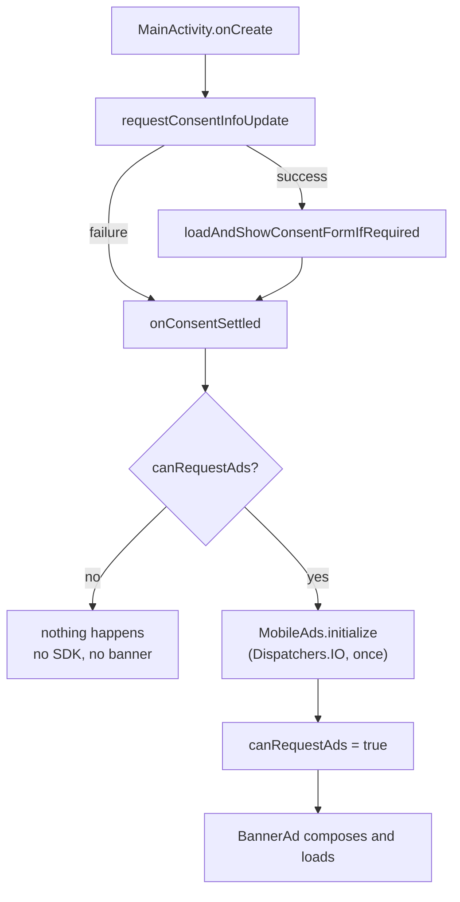

# Advertising

[← Documentation home](Home.md)

`platform/ads/Monetization.kt`, `presentation/components/BannerAd.kt`,
`app/src/main/res/values/ads.xml`, `app/src/debug/res/values/ads.xml`.

## What ships

**One anchored adaptive banner at the bottom of the screen.** That is the entire monetization
surface.

There are no interstitials, no rewarded ads, no "watch an ad to double your offline progress", and
nothing in the game is gated behind an ad. No purchase, no in-app currency, no paid tier.

**Nothing in the simulation knows this class exists.** Every failure path — no Play Services, no
network at launch, a misconfigured unit, a consent form that will not load, a player who declines
— ends the same way: the banner is not shown and the game plays exactly as it would have. An ad is
never allowed to cost the player more than the ad.

## Identifiers, and why they are not secrets

| | |
| :-- | :-- |
| App ID | `ca-app-pub-6872627319793193~7208922044` — read from the merged manifest by the Mobile Ads SDK at startup. **The SDK crashes on launch if it is missing.** |
| Banner unit | `ca-app-pub-6872627319793193/5213314092` — requested by `MonetizationController`. |

Both live in **`app/src/main/res/values/ads.xml`**, which is the single place to change them for a
different account. Neither is a secret. Both ship inside every APK and are visible to anyone who
unzips one. Nothing in that file is a key, and **no key belongs there** — see
[Security and privacy](Security-and-Privacy.md).

## Debug builds cannot reach the live account

The split is a **resource overlay**, not a runtime branch:

```
app/src/main/res/values/ads.xml     production IDs   → release
app/src/debug/res/values/ads.xml    Google's sample IDs → debug
```

Because the override happens at resource-merge time, both the manifest's
`APPLICATION_ID` meta-data and the banner request resolve to the test values in a debug build, and
nothing in the app has to decide which to use. There is no branch to get wrong, and no way for a
debug build to initialise the SDK against the live app.

| | Release | Debug |
| :-- | :-- | :-- |
| App ID | `…6872627319793193~7208922044` | `ca-app-pub-3940256099942544~3347511713` |
| Banner unit | `…6872627319793193/5213314092` | `ca-app-pub-3940256099942544/6300978111` |
| Application ID | `com.earthgame.idle` | `com.earthgame.idle.debug` |

This matters because **AdMob counts impressions and clicks a developer generates on their own live
unit as invalid traffic**, and repeat offences suspend the whole account. Google's test units
always fill, which also makes them the easiest way to check the banner's layout.

`ProductionAdConfigTest` asserts both sides of the table, that the release resources contain no
sample identifier, and that the app ID is declared exactly once per variant. It reads the
`ads.xml` files from source rather than through `R.string`, because a unit test resolves *debug*
resources and could not otherwise see the production values at all.

## Consent, then the SDK, then the banner

The order is Google's, and it is not negotiable: **the Mobile Ads SDK may preload an ad the moment
it is initialised**, so initialising before consent has been gathered is itself the violation.



- **`canRequestAds()` gates the request, not the personalisation.** When it is false — the player
  declined, or the consent update failed because there was no network at launch — the SDK is never
  started and no banner is composed.
- **`canRequestAds` is Compose state.** The flow finishes some time after the first frame; the
  banner and the Settings entry both have to notice when it does.
- **Initialisation happens once, off the main thread.** `MobileAds.initialize` does Play Services,
  disk and network work; an `AtomicBoolean` makes it idempotent and `Dispatchers.IO` keeps it off
  the launch path. Nothing waits on its callback.
- **The controller is constructed in `onCreate`**, never inside a composable.

### Why there is no `npa=1`

With a TCF-certified CMP in place, the **UMP SDK writes the IAB TCF consent signals and the Mobile
Ads SDK reads them** to choose its serving mode — personalised, non-personalised, limited, or
technical delivery. The `npa` network extra is the mechanism for publishers handling consent
*without* such a CMP.

An earlier version of this code attached `npa=1` whenever `canRequestAds()` was false and omitted
it whenever it was true, which conflated "may I request an ad" with "may I personalise it" and
would have overridden the player's actual choice in one direction. It is deliberately absent now.

## The privacy options entry point

`privacyOptionsAvailable` reflects `PrivacyOptionsRequirementStatus.REQUIRED` and is Compose state
like `canRequestAds`. When it is set, **two** entry points appear:

- Settings → **Manage advertising privacy**
- Settings → About → **Manage advertising privacy**

Both call `UserMessagingPlatform.showPrivacyOptionsForm`. It is hidden where the status is not
REQUIRED rather than offering a button that opens nothing — a player who was never shown a message
has no form to reopen. It is **not** hidden after a decision has been made, which is the case the
requirement is actually about.

Dismissing the form refreshes the flags for the session; the new consent state takes effect on the
next launch, which is how UMP works.

## Placement

The banner sits **above** the navigation, never flush against it: AdMob policy forbids placing an
ad against a control the player is tapping, and a mistap that lands on the ad is an accidental
click.

It occupies **no space at all** until an ad actually loads (`onAdLoaded` flips a flag that gives it
width; `onAdFailedToLoad` takes it back), so a device where nothing fills, a player with no
network, and a player who declined consent all lose no screen to an empty strip.

The `AdView` is destroyed in `DisposableEffect`'s `onDispose`, so it cannot leak the activity, and
it is rebuilt when the window width changes. Because `AndroidView` calls its factory once per node
and keeps that view for the node's lifetime, the banner is wrapped in `key(adView)` — without it a
width change would build and request a replacement while the *destroyed* original stayed on screen.
The activity handles `orientation` and `screenSize` itself, so that path is a plain rotation, not an
edge case.

**Build in composition, request from an effect.** `createBannerView` constructs and sizes the view;
`loadBanner` makes the request, from `DisposableEffect`, after the `AdListener` is attached. An ad
that resolves immediately — a cached fill, or a failure the SDK answers without the network — would
otherwise report to a listener that did not exist yet and leave the banner sized as though nothing
had loaded. It also keeps an abandoned composition from spending a request on an `AdView` nobody
will ever destroy.

Adaptive sizing uses `AdSize.getLargeAnchoredAdaptiveBannerAdSize` against
`LocalWindowInfo.current.containerSize` rather than `Configuration.screenWidthDp`, which rounds to
the nearest dp and treats insets differently by target SDK.

## Testing ads

| What to test | How |
| :-- | :-- |
| **Banner loads** | Install the debug build. Google's test unit always fills. |
| **No network** | Airplane mode, then launch. Expect: no banner, no crash, no hang, simulation unaffected. |
| **Network lost mid-session** | Airplane mode with the banner on screen. Expect: no crash. |
| **Consent required** | A debug build forces `DEBUG_GEOGRAPHY_EEA`. On an emulator that is enough; on hardware, paste the hashed device ID the UMP SDK logs into `ump_test_device_hashed_id` in the debug overlay. |
| **Consent granted** | Accept the form. Expect: banner appears. |
| **Consent denied** | Refuse the form. Expect: **no banner at all**, and a fully playable game. |
| **Returning to the app** | Background and resume repeatedly. Expect: no second consent form, no second SDK initialisation. |
| **Privacy options form** | Settings → Manage advertising privacy, and About → the same. Expect: the form opens; a changed choice applies next launch. |
| **Ad failure** | Temporarily point the debug overlay at a malformed unit ID. Expect: `onAdFailedToLoad`, no banner, no crash. |
| **Production identifiers** | `./gradlew test` runs `ProductionAdConfigTest`; then verify the artifact itself with `aapt2 dump resources`. |

> **Never click a live production advertisement.** Developer clicks on your own live unit are
> invalid traffic and get accounts suspended. Tap-testing belongs on the debug build, where the
> unit is Google's.

## Configured outside this repository

Two things are on whoever ships it:

- The **GDPR/EEA consent message** has to be created under *Privacy & messaging* in the AdMob
  console. The UMP form is loaded from there, not bundled here. **Without it the flow reports that
  ads may not be requested, and no banner appears in the EEA/UK** — which is the correct behaviour,
  but it looks like a bug.
- The **Play Console data-safety form** has to declare the advertising ID, because
  `play-services-ads` merges `com.google.android.gms.permission.AD_ID` into the manifest. See
  [Data safety](../GOOGLE_PLAY_DATA_SAFETY.md).

## Under-age users

EARTH has **no age gate**: it does not ask a player's age and does not infer one. Accordingly it
sets neither `setTagForChildDirectedTreatment` nor `setTagForUnderAgeOfConsent` — there is no
truthful basis for either, and guessing would be worse than omitting them. The store listing
declares a 13+, not-primarily-child-directed audience, which is the configuration that matches.

Targeting children would be a different app: it would need an age screen, the child-directed and
under-age-of-consent flags, and a Families-policy review. See
[Privacy policy §11](../PRIVACY_POLICY.md#11-children).

## Removing ads entirely

Should a fork want to:

1. Delete `platform/ads/` and `presentation/components/BannerAd.kt`.
2. Remove the `BannerAd(...)` call from `EarthApp`, and the `MonetizationController` wiring plus
   the ad-privacy entries from `MainActivity`, `SettingsScreen` and `AboutScreen`.
3. Drop `play-services-ads` and `user-messaging-platform` from `app/build.gradle.kts` and the
   version catalog.
4. Delete both `ads.xml` files and the three `<meta-data>` elements from the manifest.
5. Remove `INTERNET` and `ACCESS_NETWORK_STATE` — **nothing else in the app uses them.**
6. Delete `ProductionAdConfigTest`, and regenerate `THIRD_PARTY_NOTICES.txt`.

Nothing in `domain/`, `data/` or the rest of `presentation/` references any of it.

---

**Next:** [Privacy](Privacy.md) · [Security and privacy](Security-and-Privacy.md) · [Android platform](Android-Platform.md)
