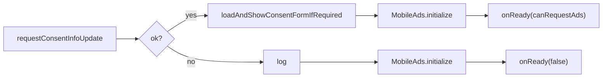

# Advertising

[← Documentation home](Home.md)

`platform/ads/Monetization.kt`, `presentation/components/BannerAd.kt`,
`app/src/main/res/values/ads.xml`.

## What ships

**One anchored adaptive banner at the bottom of the screen.** That is the entire monetization
surface.

There are no interstitials, no rewarded ads, no "watch an ad to double your offline progress", and
nothing in the game is gated behind an ad. No purchase, no in-app currency, no paid tier.

**Nothing in the simulation knows this class exists.** Every failure path — no Play Services, no
network at launch, a misconfigured unit, a consent form that will not load — ends the same way:
the banner is not shown and the game plays exactly as it would have. An ad is never allowed to
cost the player more than the ad.

## Identifiers, and why they are not secrets

Both AdMob identifiers live in **`app/src/main/res/values/ads.xml`**, which is the single place to
change them for a different account:

| | |
| :-- | :-- |
| App ID | Read from the manifest by the Mobile Ads SDK at startup. **The SDK crashes on launch if it is missing.** |
| Banner unit id | Requested by `MonetizationController`. |

Neither is a secret. Both ship inside every APK and are visible to anyone who unzips one. Nothing
in that file is a key, and **no key belongs there** — see [Security and privacy](Security-and-Privacy.md).

## Debug builds never touch the live unit

```kotlin
fun bannerUnitId(context: Context): String =
    if (isDebuggable(context)) TEST_BANNER_UNIT_ID else context.getString(R.string.admob_banner_unit_id)
```

AdMob counts impressions and clicks a developer generates on their own live unit as **invalid
traffic**, and repeat offences suspend the whole account. So a live unit is only ever requested
from a non-debuggable build. Installing the debug APK shows Google's public test banner, which
always fills — which is also the easiest way to check the layout.

## Consent, then the SDK, then the banner

Order matters: serving ads in the EEA or UK without a consent message is a policy violation.



When no choice can be recorded at all — the form failed to load, or UMP itself errored — the SDK is
still started but **personalization is switched off**, which is the conservative reading. The
`npa=1` extra is attached to the ad request itself rather than set globally.

`privacyOptionsAvailable` reflects `PrivacyOptionsRequirementStatus.REQUIRED`, and Settings shows a
"privacy options" entry only when a form actually exists to reopen.

## Placement

The banner sits **above** the navigation, never flush against it: AdMob policy forbids placing an
ad against a control the player is tapping, and a mistap that lands on the ad is an accidental
click.

It occupies **no space at all** until an ad actually loads (`onAdLoaded` flips a flag that gives it
width; `onAdFailedToLoad` takes it back), so a device where nothing fills, or a player with no
network, loses no screen to an empty strip.

The `AdView` is destroyed in `DisposableEffect`'s `onDispose`, so it cannot leak the activity, and
it is rebuilt when the window width or the personalization choice changes.

Adaptive sizing uses `LocalWindowInfo.current.containerSize` rather than
`Configuration.screenWidthDp`, which rounds to the nearest dp and treats insets differently by
target SDK.

## Configured outside this repository

Two things are on whoever ships it:

- The **GDPR/EEA consent message** has to be created under *Privacy & messaging* in the AdMob
  console. The UMP form is loaded from there, not bundled here. A debug build forces the EEA debug
  geography so the flow can be exercised anywhere.
- The **Play Console data-safety form** has to declare the advertising ID, because
  `play-services-ads` merges `com.google.android.gms.permission.AD_ID` into the manifest.

## Removing ads entirely

Should a fork want to:

1. Delete `platform/ads/` and `presentation/components/BannerAd.kt`.
2. Remove the `BannerAd(...)` call from `EarthApp`, and the `MonetizationController` wiring plus
   the ad-privacy entry from `MainActivity` and `SettingsScreen`.
3. Drop `play-services-ads` and `user-messaging-platform` from `app/build.gradle.kts` and the
   version catalog.
4. Delete `res/values/ads.xml` and the three `<meta-data>` elements from the manifest.
5. Remove `INTERNET` and `ACCESS_NETWORK_STATE` — **nothing else in the app uses them.**

Nothing in `domain/`, `data/` or the rest of `presentation/` references any of it.

---

**Next:** [Security and privacy](Security-and-Privacy.md) · [Android platform](Android-Platform.md)
