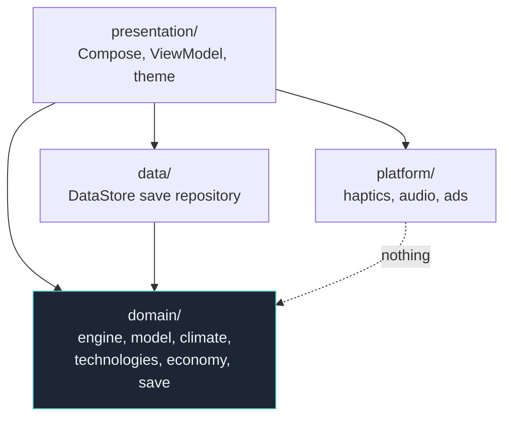

# Architecture

[← Documentation home](Home.md)

EARTH is a single Gradle module (`:app`) with four internal layers. The layering is not
enforced by the build — there is no per-layer module — so it is enforced by convention, by
review, and by the fact that breaking it makes the tests slow enough that you notice.

```
app/src/main/java/com/earthgame/idle/
  domain/         Pure Kotlin. The entire game.
  data/           Persistence.
  platform/       Android capabilities, behind interfaces.
  presentation/   ViewModel + Compose UI.
```

## Dependency direction



Everything points **inward** at `domain/`. Nothing points out of it.

| Layer | May depend on | May **not** depend on |
| :-- | :-- | :-- |
| `domain/` | Kotlin stdlib, `java.math`, `kotlin.random`, `kotlinx.serialization.json` — and nothing else (verified) | Android, Compose, coroutines, DataStore, anything in the other three layers |
| `data/` | `domain/`, Android, DataStore, coroutines | `presentation/`, `platform/` |
| `platform/` | Android | `domain/`, `data/`, `presentation/` |
| `presentation/` | all of the above | — |

## Why `domain/` is free of Android

This is the single most important rule in the codebase, and it buys four concrete things:

1. **The tests are fast.** 220 JVM tests run in a few seconds. A simulation coupled to Android
   would need Robolectric or a device for all of them; here only the persistence and UI tests
   pay that cost.
2. **The offline path is provably the live path.** `simulateStep` cannot read a clock, so
   "what happened over eight hours" is a parameter rather than a wait. There is no second
   implementation to keep in sync.
3. **Parity against the reference is possible at all.** The [TypeScript oracle](Reference-Parity.md)
   is also platform-free, so its captured answers can be replayed against Kotlin directly.
4. **The engine is portable.** Not a goal, but it means the game is not held hostage by an
   Android API change.

### How the rule is checked

There is no automated import-boundary check. Verify it by hand:

```bash
# Must print nothing.
grep -rn "^import android\|^import androidx\|^import kotlinx.coroutines" \
  app/src/main/java/com/earthgame/idle/domain/
```

The practical guard is that `domain/` is covered by tests in `app/src/test/` that do **not**
use `@RunWith(RobolectricTestRunner::class)`. Introduce an Android import into `domain/` and
those tests stop being able to run.

> Adding an automated check for this — a lint rule or a Konsist-style test — is listed as an
> open recommendation in [the audit](../CODEBASE_AUDIT.md).

## What lives where

### `domain/`

| Package | Responsibility |
| :-- | :-- |
| `engine/` | [`GameDecimal`](GameDecimal.md), [`Constants`](Economy-and-Production.md), [`Simulation`](Simulation.md), `Ownership`, [`Offline`](Offline-Progression.md), [`GameLoop`](Game-Engine.md) |
| `model/` | [`GameState`](Game-State.md), `Gases`, `Resources`, `Amounts` (the array-backed containers) |
| `climate/` | [`Climate`](Climate-Model.md) (integration, forcing, temperature), `Habitability` |
| `technologies/` | 11 branch data files, `Scaling`, `TechnologyRegistry`, `TechnologyTypes` |
| `economy/` | [Purchasing and the price-stability invariant](Economy-and-Production.md) |
| `prestige/` | [Earth Points and the upgrade tree](Prestige-System.md) |
| `achievements/` `challenges/` `events/` `milestones/` | [Content and its checks](Achievements-and-Challenges.md) |
| `formatting/` | The four number notations |
| `save/` | [Serialization](Save-System.md) and [the migration chain](Save-Migrations.md) |

### `data/`

`repository/SaveRepository` is the interface plus `LoadResult`; it names no Android type, so
tests drive a real save/load cycle in memory. `persistence/DataStoreSaveRepository` is the only
implementation. See [Save system](Save-System.md).

### `platform/`

Three adapters — `haptics/`, `audio/`, `ads/` — each an interface with a real implementation and
a no-op one (`NoHaptics`, `SilentAudio`). The game is fully playable with all three inert, and
that is the state every test runs them in. See [Audio and haptics](Audio-and-Haptics.md) and
[Advertising](Advertising.md).

### `presentation/`

`GameViewModel` owns the tick loop, the autosave cadence and the single `StateFlow`. `EarthApp`
is the shell. See [UI architecture](UI-Architecture.md) and [Navigation](Navigation.md).

## The composition root

There is no dependency-injection framework, and that is a deliberate size judgement: the game
has exactly three long-lived collaborators. `EarthApplication` constructs them lazily and
`GameViewModel.Factory` hands them over.

```kotlin
class EarthApplication : Application() {
    val saveRepository: SaveRepository by lazy { DataStoreSaveRepository(applicationContext) }
    val haptics: Haptics by lazy { AndroidHaptics(applicationContext) }
    val audio: GameAudio by lazy { SoundPoolAudio(applicationContext) }
}
```

Adding Hilt would add a compiler plugin, a build-time cost and a layer of indirection to
resolve three objects. If the collaborator count ever grows past about six, revisit it.

## Deliberate absences

| Not used | Why |
| :-- | :-- |
| A DI framework | Three dependencies. See above. |
| `NavHost` | Nine tabs need a real back stack, which `NavHost`'s default did not give. See [Navigation](Navigation.md). |
| Room / SQLite | The save is one document, not a set of queryable rows. DataStore's atomic writes are exactly the guarantee needed. |
| A background service / WorkManager | Offline progress is a closed-form calculation on return, not a simulation that has to keep running. See [Offline progression](Offline-Progression.md). |
| Multiple Gradle modules | Would enforce the layering at build time, at the cost of build complexity for a single-app project. A reasonable future change; see [the audit](../CODEBASE_AUDIT.md). |
| `@Immutable` in `domain/` | It would drag `androidx.compose.runtime` into the platform-free layer. Stability is declared from outside instead, in `app/compose-stability.conf`. See [UI architecture](UI-Architecture.md). |

---

**Next:** [Game engine](Game-Engine.md) · [UI architecture](UI-Architecture.md) · [Contributing](Contributing.md)
