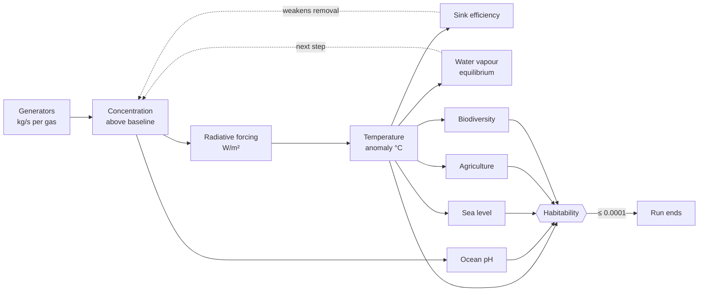

# Climate model

[← Documentation home](Home.md)

> [!CAUTION]
> **THIS IS A GAMEPLAY MODEL, NOT A SCIENTIFIC CLIMATE MODEL.**
>
> The *relationships* are real ones — CO₂ forcing genuinely is logarithmic, gases genuinely have
> wildly different atmospheric lifetimes, warming genuinely does weaken natural carbon sinks — and
> the coefficients are loosely modelled on published approximations. But the numbers are tuned so
> that a multi-day game behaves coherently from one campfire to 10⁴⁰⁰ kg of methane, and several
> are scaled by orders of magnitude to make that work. Nothing here predicts anything. Do not
> cite it.
>
> Where a constant departs from reality on purpose, this page says so and says why.

Files: `domain/climate/Climate.kt`, `domain/climate/Habitability.kt`, `domain/model/Gases.kt`, and
the constants in `domain/engine/Constants.kt`.

## The chain



## Gases

`atmosphere` tracks each gas as the concentration **above its pre-industrial baseline**, in the
gas's native unit. The baseline is assumed to be a natural steady state (equal natural emission
and removal) and is not simulated — only the anthropogenic perturbation is. That keeps the
numbers meaningful (extra == 0 at game start) without modelling pre-industrial gas cycles.

| Gas | Unit | Baseline | kg per unit | Half-life (yr) | Forcing response |
| :-- | :-- | --: | --: | --: | :-- |
| CO₂ | ppm | 280 | 2 × 10¹² | 120 | `5.35 · ln(C / C₀)` |
| CH₄ | ppb | 700 | 2.75 × 10⁹ | 12 | `0.036 · (√C − √C₀)` |
| N₂O | ppb | 270 | 1.6 × 10¹⁰ | 114 | `0.12 · (√C − √C₀)` |
| H₂O | ppm | 0 | 1 × 10¹³ | 0.03 (~11 days) | `0.0007 · max(C − C₀, 0)` |
| O₃ | DU | 300 | 5 × 10⁹ | 0.06 (~3 weeks) | `0.4 · ln(C / C₀)` |
| Fluorinated | ppt | 0 | 3 × 10⁷ | 3200 | `0.00015 · max(C − C₀, 0)` |

Logarithmic for CO₂ and O₃ because their absorption bands are already partly saturated;
square-root for CH₄/N₂O; linear for the trace fluorinated bucket, which sits on the unsaturated
part of its band.

**Two mass scalings are deliberately unrealistic, and the game does not work without them:**

- **CO₂ at 2 × 10¹² kg/ppm** instead of the real ~7.8 × 10¹². CO₂ is the gas this game is
  *about*; at the real ratio a whole run's combustion moves the needle by a couple of hundred ppm
  and the marquee gas ends up a rounding error next to the synthetic ones.
- **Fluorinated at 3 × 10⁷ kg/ppt.** Trace gases are absurdly potent per kilogram, and with a
  linear forcing response and a 3,200-year lifetime an unscaled value lets one late branch
  out-heat every fire, furnace and engine in the run combined. Scaled so f-gases stay a nasty
  late-game accelerant rather than the whole apocalypse.

`computeForcing` handles a **negative** O₃ excess correctly — CFC technologies deplete ozone, and
below baseline the forcing term goes negative — and `ClimateParityTest` covers that arithmetic.
But the integration clamps every gas at zero excess, so in play O₃ bottoms out *at* its 300 DU
baseline and never goes below it. The "Ozone Hole" achievement, which wants −50 DU, is therefore
unreachable. That predates the half-life work and is left alone here: letting ozone go negative
would be a balance change, not a bug fix. See the [codebase audit](../CODEBASE_AUDIT.md).

### Natural removal

```kotlin
fun naturalRemovalRateConstant(gas) =
    ln(2.0) / (gas.halfLifeYears * REAL_SECONDS_PER_GAME_YEAR)
```

A first-order per-second decay constant, `λ = ln 2 / H`, so a stock left alone follows
`C(t) = C₀ × 2^(−t/H)` exactly: 1,000 with a 120-year half-life is 500 after 120 simulated years.

The half-lives are counted in **simulated** years, not real ones — one real second of simulation
is one simulated day, so CO₂'s 120 years is 12.2 real hours. Dividing by
`REAL_SECONDS_PER_GAME_YEAR` rather than by a year of real seconds is the whole of that
conversion, and it happens once, here. Water vapour is the documented exception: it is a feedback
rather than a stock and keeps its real-clock relaxation rate.

[**Atmospheric half-life**](Atmospheric-Half-Life.md) is the full page on this — the equation,
the two clocks, how production competes with decay, the offline behaviour and the numerical
edges.

## Gas integration

The exact analytic solution to first-order decay toward an equilibrium:

```
dE/dt = production − k·E        with k = (ln 2 / halfLife) × sinkEfficiency

E(t + Δt) = E(t)·e^(−kΔt) + (production/k)·(1 − e^(−kΔt))
```

```kotlin
val decayFactor = exp(-k * dtSeconds)
val equilibrium = netProduction / k
val result = extraConcentration * decayFactor + equilibrium * (1.0 - decayFactor)
return result.clampMin(GameDecimal.ZERO)
```

Being closed-form is not just an optimisation: it is **why a 250 ms tick and an 8-hour catch-up
produce identical numbers for the same elapsed time**, and therefore why
[offline progress](Offline-Progression.md) is one calculation rather than a loop.

Engineered removal (carbon capture, reforestation, terraforming engines) is a flat subtraction
from the production term. If removal exceeds production the result is clamped at zero — a gas
can never be driven negative by engineering. `ClimateParityTest.engineered removal exceeding
production never drives a gas negative` asserts it.

The `k <= 0` branch (linear growth) is defensive; the sink floor below makes it unreachable.

## Sink efficiency

```kotlin
efficiency = 1 / (1 + 0.045 · max(0, tempAnomaly))
return max(0.05, efficiency)
```

Natural sinks weaken as the world warms — ocean stratification reducing mixing, permafrost thaw,
forest dieback. Floored at **5%** so removal never fully stops and the formulas stay stable at
absurd temperatures.

> **A known quirk, preserved for parity.** Sink efficiency multiplies `k`, and the H₂O
> equilibrium target is fed in as `equilibrium × k_raw`, so the effective H₂O equilibrium becomes
> `target / sinkEfficiency` — i.e. a hot planet holds *more* feedback water vapour than the target
> alone implies. This matches the reference implementation exactly and is part of what makes the
> late-game temperature curve escalate. Changing it would be a balance change, not a bug fix.

## Radiative forcing

Per gas, from the **absolute** concentration (baseline + extra) against its baseline; summed for
the total. Cached on `GameState.forcing` as a per-gas breakdown plus the total, which is what the
Atmosphere screen's "Heating Contribution" rows read.

## Temperature

```kotlin
val forcing = max(0.0, totalForcingWm2)
val linear = 0.8 * forcing
val superLinear = 0.02 * forcing.pow(1.35)
return linear + superLinear
```

`climateSensitivity = 0.8` °C per W/m² corresponds to a real-world-plausible ~3 °C per CO₂
doubling (3.7 W/m²). The super-linear term is **not** physical: it exists so extreme late-game
forcing keeps escalating into the increasingly absurd temperatures the endgame is going for,
instead of flattening out into a plateau where nothing more happens.

## Water vapour

Modelled as a **feedback**, never emitted:

```kotlin
fun computeWaterVaporFeedbackConcentration(previousTempAnomalyC: Double) =
    max(0.0, previousTempAnomalyC) * 400.0     // ppm per degree
```

`simulateStep` substitutes `equilibrium × k` for H₂O's production rate rather than reading a
generator, and drives it toward that equilibrium with H₂O's own (very short) lifetime as the
relaxation rate. Using the *previous* anomaly closes the loop one step behind, which is stable
and avoids solving forcing and temperature simultaneously.

`GasDefinition.directlyEmitted` is `false` for H₂O, which is what excludes it from the gas totals
the prestige payout scores.

## Sea level

```kotlin
val dtYears = dtSeconds / (365.25 * 24 * 3600)
return currentMeters + 120.0 * max(0.0, tempAnomalyC) * dtYears
```

`simulateStep` passes the **mean** of the old and new anomaly over the interval, which is a
midpoint rule rather than a forward Euler step.

**120 m per degree-year is a game-time rate, not a real one.** A run lasts days, which is a
couple of hundredths of a simulated year; the real-world figure (~0.1 m per degree-century) would
produce a millimetre a run and leave both the sea-level habitability factor and every coastal
consequence completely inert.

## Ocean pH

```kotlin
pH = 8.1 - 0.00035 * max(0.0, co2ExtraPpm)
```

Driven by the CO₂ *above* baseline. Reaching pH 7.0 unlocks "Acid Ocean".

## Habitability

Five independent 0–1 "goodness" factors, **multiplied**:

| Factor | Formula | Zero at |
| :-- | :-- | :-- |
| Temperature | `clamp01(1 − (T/55)²)` | +55 °C |
| Ocean acidity | `clamp01((pH − 6.0) / (8.1 − 6.0))` | pH 6.0 |
| Sea level | `clamp01(1 − metres/220)` | 220 m |
| Agriculture | `1 − 0.05·(T/3)` up to +3 °C, then `clamp01(0.95·e^(−(T−3)/8))` | asymptotic |
| Biodiversity | `1 − 0.03·(T/4)` up to +4 °C, then `clamp01(0.97·e^(−(T−4)/6))` | asymptotic |

Multiplying rather than averaging is the whole design: **any single factor collapsing drives
habitability to zero even if the others are fine** — the flavour of "one broken system can end a
civilization" without a fully coupled model. `ClimateParityTest.habitability is multiplicative,
so one collapsed factor ends the run` asserts it.

`fraction <= 0.0001` latches `GameState.collapsed`, which is the reset trigger.

## Testing

| Test | Covers |
| :-- | :-- |
| `ClimateParityTest` | 13 cases against the reference: sink efficiency and its floor, half-lives and decay constants, the half-life law against the integrator, the simulated clock, **3,240 gas integrations** across every gas × production rate × removal state × sink efficiency × step size from 250 ms to a day, per-gas and total forcing, negative O₃ forcing, temperature including the super-linear tail, water vapour, all five habitability factors, sea level |
| `SimulationParityTest` | Step-size independence, determinism, a 95-step scripted playthrough to collapse |

## Changing a formula

1. Change it in **both** `domain/climate/` and `tools/ts-reference/engine/`.
2. `cd tools/ts-reference && npx vitest run && npm run fixtures`.
3. `./gradlew test` — the parity tests now compare against the new reference output.
4. Review the fixture diff. If more than the file you expected changed, something coupled that
   you did not intend.
5. Update this page.

See [Reference parity](Reference-Parity.md) for the full contract.

---

**Next:** [Simulation](Simulation.md) · [Prestige system](Prestige-System.md) · [Reference parity](Reference-Parity.md)
