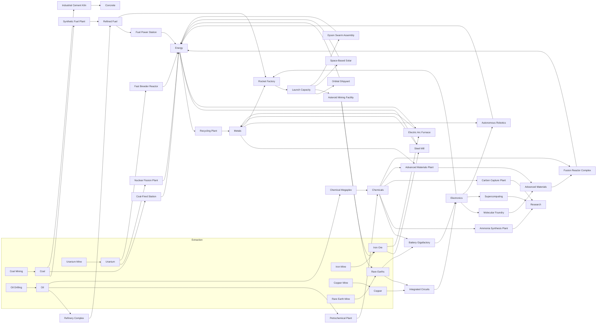

# Economy and production

[← Documentation home](Home.md)

Files: `domain/production/` (the whole production layer), `domain/economy/Economy.kt`,
`domain/economy/NextPurchase.kt`, `domain/technologies/TechnologyRegistry.kt`,
`domain/technologies/Scaling.kt`, `domain/engine/Ownership.kt`, `domain/engine/Constants.kt`.

## The shape of the economy

The game has two kinds of building and the distinction is the whole design.

| | |
| :-- | :-- |
| **Producer** | Takes no input. Turns capital into output: mines, wells, dams, solar fields, the first campfire. Always runs at 100%. |
| **Processor** | Takes a *flow* of one or more resources and turns it into another. Runs at the rate its scarcest input allows — and produces nothing it cannot pay for in inputs. |

They are separate types in the domain layer — `ProducerDefinition` and `ConsumerDefinition` in
`domain/production/ProductionModel.kt` — and separate sections on the Production screen. Both are
*projections* of a `Technology`, not a second catalogue: ownership, pricing, prerequisites, saving
and prestige all keep working on technologies, so a building has exactly one identity and exactly
one id.

## The one pricing invariant

> **A price never rises for any reason other than your own purchases of that exact thing.**

The amount charged for a technology is a pure function of `(technology, how many of that
technology you already own)`, scaled **down — never up** — by the prestige discount. Nothing about
the rest of the civilization enters into it:

- a one-time unlock, multiplier or choice is quoted once and costs exactly that forever;
- a building's **first** unit always costs its listed base price, and only the units *you* have
  bought of it make the next one dearer.

The reference implementation once had a civilization-complexity surcharge that multiplied every
price by the number of distinct technologies owned. It is gone. Pacing comes entirely from the
tier curves, which are baked into a listed price up front and never move. `EconomyParityTest` locks
this in. **Do not add anything that scales a price by global state.**

The player-facing payoff is the countdown on a Buy button: because prices never move, "affordable
in 4m 12s" is a promise rather than an estimate.

## Resources

Fifteen currencies (`ResourceId`), classified by what they are for. Every id here is a save key and
new entries are only ever **appended**, because `ResourceAmounts` is indexed by enum ordinal.

| Class | Resources |
| :-- | :-- |
| **Energy** | Energy — the universal industrial currency, made by nearly everything |
| **Raw** | Coal, Oil, Iron Ore, Copper, Uranium, Rare Earths |
| **Processed** | Refined Fuel, Chemicals, Metals, Concrete |
| **Advanced** | Electronics, Advanced Materials, Launch Capacity |
| **Special** | Research |

> **Metals** is persisted under the id `steel`, which predates the rename and is kept so existing
> saves keep their balance — see [Save migrations](Save-Migrations.md).

Two resources are deliberate dead ends and say so in their own definitions
(`ResourceDefinition.deadEndReason`): **Research** is the tree's currency and is spent, never
processed; **Concrete** is a pure building material. `validateEconomy` reports any *other*
resource that nothing consumes and nothing costs.

## The production graph



`EconomyDiagnostics.mermaidDiagram()` regenerates the exhaustive version of this from the live
definitions, and `EconomyDiagramTest` fails if a processor or a resource is missing from this page.

### Loops are allowed, and here is why they are safe

The graph deliberately contains cycles. Energy runs the mills, the mills make the Metals the
reactors are built out of, and the reactors make Energy — `energy → steel → advanced_materials →
energy` is a real loop, and there are eight of them.

Forbidding cycles outright would forbid a power station that runs on something industry produced.
What makes a loop safe is **anchoring**:

> Every loop must have at least one step where *every* processor that could perform it needs a
> resource the loop does not produce.

A steel mill needs Iron Ore. An advanced-materials plant needs Chemicals. Neither is made inside
that loop, so the loop cannot spin on its own and is tied back to a mine somebody had to buy — and
to the emissions that mine makes. `validateEconomy`'s `self-sustaining-production-loop` rule and
`EconomyValidationTest` check exactly that.

A second guarantee sits underneath, in the solver rather than the data: utilization is capped at 1,
so total supply can never exceed the sum of what the buildings the player actually bought are rated
for, whatever shape the graph has. `ResourceFlowTest.a loop cannot amplify supply` asserts it.

## The production pipeline

`domain/production/ResourceFlow.kt`, run once per state change by `computeProductionRates`.

A processor runs on **flow, not on stockpiles**. A refinery cracks the oil arriving this second; it
cannot dip into the barrels you are saving to buy the next derrick. That single rule buys four
properties the game needs:

1. **No negative balances, ever.** Consumption is capped at supply before any balance is touched.
2. **Offline is exact, not approximated.** Rates are constant across an absence, so one closed-form
   step over twelve hours is bit-identical to 172,800 live ticks.
3. **Order independence.** The answer is a fixed point of the whole system, not the result of
   walking a list.
4. **A readable bottleneck.** "73%, limited by Oil" is a statement about rates — the thing the
   player can go and fix.

The stages, in order:

| # | Stage |
| --: | :-- |
| 1 | **Producer supply** — every input-free building's output, with global, branch and ownership multipliers applied |
| 2 | **Consumer demand** — `owned × inputsPerUnit × ownershipMultiplier(owned)`, and nothing else |
| 3 | **Allocation** — supply shared out by max-min fairness, giving each processor a utilization in `[0, 1]` |
| 4 | **Consumption and output** — each processor eats `utilization × demand` and makes `utilization × rated output` |
| 5 | **Emissions** — scaled by the same utilization: a refinery at 40% emits 40% of its rated carbon |
| 6 | **Conservation clamp** — a hard cap of consumption at supply, so every net rate is provably `>= 0` |
| 7 | **Net** — `net = supply − consumption`, which is what the wallet gains |

### The allocation rule

When several processors want the same resource, supply is split by **max-min fairness**: find the
scarcest resource, cap everyone who needs it at the ratio it can support, subtract what they take,
and repeat with what is left. Nobody is starved because they happen to be defined later in a file,
and a processor already limited by a *different* input releases the share of this one it was never
going to use.

Because processors feed processors, supply itself depends on the answer, so the allocation is
iterated to a fixed point. Starting from "everything runs flat out", each round can only lower
utilization, so the sequence is monotone, bounded and converges; two or three rounds settle it in
practice, and the loop stops as soon as nothing moves (`PRODUCTION.maxSolverRounds` caps the cost).

### Size versus efficiency

Two different things multiply a building, and only one of them touches what it eats.

- **Size** — units owned, times the ownership milestones those units have earned. A processor that
  has doubled through a milestone is a *bigger factory*: it pushes twice as much through and takes
  twice as much in. **Demand scales with size**, which keeps a chain in balance as both ends of it
  deepen — ten mines feeding ten mills stay in the same proportion at a hundred of each.
- **Efficiency** — prestige, events, branch bonuses, The Wheel. These multiply **output only**.

If an efficiency bonus multiplied both sides it would be a no-op across the whole processing half
of the economy: a ×10 on a refinery's fuel output and a ×10 on its oil demand cancel exactly, and
the prestige tree would silently stop working the moment a chain was unlocked. Instead a prestige
bonus reads the way it should — same intake, more output, and a bottleneck that eases.

### The anti-softlock rule

`PRODUCTION.maxSupplyClaimFraction = 0.9`. Processors may claim at most 90% of any resource's gross
supply.

Resources are both a *flow* processors eat and a *stock* the player spends on buildings. A chain
that consumed 100% of its own feedstock would freeze that stock forever: the player could never buy
the extra derricks that would break the bottleneck. A tenth of every resource always reaches the
wallet, so expanding out of a shortage is always possible — which is the entire point of a
bottleneck being visible.

## Bottlenecks in play

The core loop the chains add:

> **Produce → process → hit a bottleneck → expand the scarce input → unlock the next stage.**

Each processor card shows its utilization, the input holding it back, and — one tap further — what
it wants, what the economy supplies, and what it is actually taking. The resource-flow panel at the
top of the Production screen shows held / produced-per-second / consumed-per-second / net for every
resource in play.

Ten steel mills fed by ten iron mines run at roughly 64%, limited by Iron Ore. That is deliberate:
the first processor a player ever owns has to be one they go and feed, or the mechanic never
teaches itself. `EconomyBalanceSimulationTest` asserts both halves — that it *is* short, and that
buying more mines is what fixes it.

## Ownership milestones

`domain/engine/Ownership.kt`.

Every building carries its own progress track. Crossing a milestone multiplies that building's
entire output permanently, for the rest of the run.

### The progressive ladder

Milestones used to land on every tenth unit forever. They now **spread out as a building deepens**,
which is what gives the NEXT buy mode something meaningful to aim at late in a run.

```
step(owned) = baseStep + stepGrowthPerBlock × (owned / blockUnits)     // integer division
```

with `baseStep = 10`, `blockUnits = 100`, `stepGrowthPerBlock = 1`, and one extra rule: **a
milestone never steps across a block boundary**, so the round numbers stay round.

| Units owned | Step | Milestones in the block |
| :-- | --: | :-- |
| 0–100 | 10 | 10, 20, 30, … 90, **100** |
| 100–200 | 11 | 111, 122, 133, 144, 155, 166, 177, 188, 199, **200** |
| 200–300 | 12 | 212, 224, 236, 248, 260, 272, 284, 296, **300** |
| 300–400 | 13 | 313, 326, 339, 352, 365, 378, 391, **400** |
| 900–1000 | 19 | 919, 938, 957, 976, 995, **1000** |

The growth is deliberately **linear in the block index, not exponential**. Ten blocks in, the
interval has not quite doubled; a player 3,000 units deep still earns a reward every 40 units,
which is a few minutes of an idle game rather than an afternoon. Pure exponential spacing would
have made the late game silent. `BalanceInvariantsTest` asserts the spacing never shrinks and never
exceeds 70 units; `MilestoneLadderTest` pins the sequence itself.

### The reward

Every milestone pays ×2, which is exactly what the old fixed ladder paid — so **the power curve of
the early game, the part players replay, is unchanged**. Going very deep is slightly weaker than it
was, which is the intended effect of sparser milestones.

The rewards are data (`OwnershipMilestoneDefinition`, `milestoneAt(index)`), not an
`if (count % 10 == 0)`, so a future rebalance can make a particular rung worth more than its
neighbours without touching the engine.

> `OWNERSHIP_BONUS.multiplier` must stay **below** `generatorCostGrowth(tier)^baseStep` for every
> building, or depth outruns the price that buys it and the tech tree stops mattering. The first
> block is the tightest case; later blocks are wider and only make the inequality safer.
> `BalanceInvariantsTest` checks it per technology.

### Divergence from the reference

The reference implementation's ladder is every ten units forever. This build agrees with it exactly
below **100 owned** and deliberately diverges above it. `EconomyParityTest` asserts both halves: the
shared range against the reference's own fixtures, and the divergence against the documented new
ladder. See [Reference parity](Reference-Parity.md).

## Buying

### The five modes

`×1 · ×10 · ×100 · NEXT · MAX`

Four are a fixed number. **NEXT** is not: it resolves against how many of *that* building you own.

### NEXT

`domain/economy/NextPurchase.kt`.

> Buy exactly enough units to land on this building's next ownership milestone, and not one unit
> more.

```kotlin
getNextMilestone(currentOwned)            // 37 -> 40,  96 -> 100,  100 -> 111,  199 -> 200
getUnitsToNextMilestone(currentOwned)     // 3,          4,          11,          1
getNextPurchaseCost(tech, owned, target)  // the exact geometric-series sum over those units
```

The button names both numbers — **`Next ×11 → 111`** — so nobody has to do arithmetic against a
progressively-spaced ladder in their head.

Its one rule, and the reason it is not just another quantity: **it is all-or-nothing.** Owning 190
with the milestone at 199 and money for eight, the button does not quietly buy eight — that would
spend the money and deliver nothing the player asked for. It stays disabled and says
*"need 1 more unit · Max would buy 8"*. Buying eight is what **MAX** is for.

`purchaseTechnology(..., requireFullQuantity = true)` is what enforces it in the engine, and
`quoteNextPurchase` runs the identical affordability check the engine will run — so a live NEXT
button can never be refused on tap, and a disabled one is never hiding a purchase that would have
worked.

### Pricing maths

The next unit:

```kotlin
nextPurchaseCost(tech, owned) = tech.cost.map { it.baseAmount * growth.pow(owned) }
// growth = 1.0 for one-time nodes, tech.costGrowth for buildings
```

Several at once — the sum of a geometric series, closed-form, never a loop:

```
total = base · (growth^quantity − 1) / (growth − 1)
```

Buy-max inverts that series, so "Max" is a logarithm rather than a loop even for thousands of units:

```
balance ≥ base · (growth^n − 1)/(growth − 1)
    ⟹ n ≤ log(balance·(growth−1)/base + 1) / log(growth)
```

> [!IMPORTANT]
> The logarithm is evaluated in floating point, so on a boundary it can land one unit either side of
> the true answer. **Over-counting is the dangerous direction:** the caller would charge more than
> the player has, the subtraction clamps at zero, and the player gets a free purchase. The last unit
> is settled against the exact geometric-series cost instead, capped at 4 corrections.

All five modes read the same curve through the same functions, so no two of them can ever disagree
about what a run of units costs — `NextPurchaseTest.buying x1 three times costs exactly what next x3
costs` asserts it directly.

### The prestige discount

`effectiveCostAmount(nominal, discount) = nominal * (1 − min(0.9, discount))` — capped at 90% so a
price can never reach zero. `nominalizeWallet` restates the player's balances in the units the cost
curves are written in, which lets the closed-form affordability maths stay ignorant of the discount
and means **the UI and the engine answer affordability with the same function.**

## The balance curves

Every technology's cost and output is derived from its **tier** through `Scaling.kt`, which reads
`BALANCE` in `Constants.kt`.

| Constant | Value | What it is |
| :-- | --: | :-- |
| `productionGrowthPerTier` | 2.0 | Per-tier growth of a building's per-unit **resource** output |
| `gasProductionGrowthPerTier` | 1.7 | Per-tier growth of its per-unit **gas** output |
| `generatorCostGrowthPerTier` | 3.05 | Per-tier growth of its base (first-unit) cost |
| `unlockCostGrowthPerTier` | 3.05 | Per-tier growth of one-time node costs |
| `researchCostGrowthPerTier` | 2.85 | Per-tier growth of research costs |
| `generatorBaseCost` | 10.0 | First-unit cost of a tier-0 building |
| `unlockBaseCost` | 9.0 | Cost of a tier-0 one-time unlock |
| `researchBaseCost` | 5.0 | Research cost of a tier-0 node |
| `gasProductionBase` | 2.0 | kg/s of one tier-0 building unit |
| `resourceProductionBase` | 0.5 | units/s of one tier-0 building unit |
| `unitCostGrowth` | 1.15 | Cost growth **per unit already owned** of the same building |
| `unitCostGrowthPerTier` | 0.0015 | Extra per-unit growth added per tier |
| `flattenLadderFromTier` | 16.0 | Above this, cost and production ladders compress together |
| `lateTierCompression` | 0.55 | How much of a tier step still counts above the knee |
| `maxSupplyClaimFraction` | 0.9 | The largest share of a resource processors may claim |
| `maxSolverRounds` | 12 | Cap on fixed-point rounds in the flow solver |

### The ratio that paces the game

```
r = generatorCostGrowthPerTier / productionGrowthPerTier = 3.05 / 2.0 = 1.525
```

A tier's income scales with `productionGrowthPerTier^tier` while the next tier's price scales with
`generatorCostGrowthPerTier^tier`, so the wall-clock time to climb one tier is multiplied by `r`
every tier. **With `r ≤ 1` the game runs away and finishes itself in minutes.**

### Why gas grows more slowly than resources

`gasProductionGrowthPerTier` (1.7) is deliberately below `productionGrowthPerTier` (2.0). If
emissions grew as fast as the economy, the planet would always collapse a few tiers before the tree
ran out and the last technologies would be unreachable content.

Processors participate in that the same way producers do, with one addition: **emissions scale with
utilization**. A starved refinery does not burn what it never received, which keeps the climate
model honest about a chain that is not actually running.

### The late-tier knee

```kotlin
fun ladderTier(tier: Double): Double {
    val knee = 16.0
    return if (tier <= knee) tier else knee + (tier - knee) * 0.55
}
```

Below tier 16 the tree is broad and total income climbs steeply. Above it the tree narrows, so a new
tier adds one building to a large static base. **Both ladders are compressed by the same function** —
compressing costs without compressing output would hand the late game back its runaway.

## Validation

`domain/production/EconomyValidation.kt`. `validateEconomy()` runs every rule below and returns
everything wrong with the graph. `EconomyValidationTest` fails the build on any problem, and
`EarthApplication` throws at launch in a debug build, so a broken chain never reaches a device.

| Rule | Catches |
| :-- | :-- |
| `duplicate-technology-id` / `duplicate-resource-id` / `duplicate-building-id` | Two definitions sharing an identity |
| `producer-with-inputs` / `consumer-without-input` | A building declared as the wrong kind |
| `producer-without-output` / `consumer-without-useful-output` | A building that is pure cost |
| `non-positive-output` / `non-positive-input` | A rate of zero or less |
| `input-has-no-supplier` | A processor eating something nothing produces |
| `self-feeding-consumer` | A processor that both eats and makes the same resource |
| `unreachable-resource` | A resource nothing produces, so it can never be earned |
| `dead-end-resource` | A resource nothing eats and nothing costs, without a documented reason |
| `requirement-not-found` | A prerequisite that is not a technology |
| `cost-in-unproducible-resource` | A price in something that cannot be earned |
| `bounded-consumer` | A processor with a purchase ceiling |
| `unreachable-technology` | Content no chain of prerequisites leads to |
| `consumer-unlocks-before-its-supply` | A mill the player can buy and watch sit at 0% forever |
| `self-sustaining-production-loop` | A loop that needs no extraction to keep going |
| `impossible-starting-economy` | A new game that can never earn its first purchase |

`EconomyValidationTest` adds the structural checks that are easier to state as assertions: no tier
inversions (two pre-existing ones are grandfathered and named), every branch populated, every
resource class populated, every technology reachable from a new game.

## Diagnostics

`domain/production/EconomyDiagnostics.kt` — developer-only, never shown in the app, pure functions
of the definitions plus an ownership map:

- `resourceReport` — produced/s, consumed/s and net/s per resource
- `buildingReport` — type, owned, utilization, limiting input and throughput per building
- `technologyReport` — prerequisites, what each node unlocks, reachability
- `milestoneReport` — the ladder as a table
- `mermaidDiagram` — the graph, for this page
- `fullReport` — all of it, which is what a failing balance test prints

## Offline

The whole flow solve is a function of rates, and rates are constant while nothing is being bought —
which is exactly the situation during an absence. So the existing closed-form offline path needed no
new machinery: one step over twelve hours produces the same numbers as 172,800 live ticks, chains,
bottlenecks and multi-input processors included.
`ProductionChainLifecycleTest.a bottlenecked chain produces the same amount offline as it does live`
asserts it against a deliberately starved economy. See [Offline progression](Offline-Progression.md).

## `secondsUntilAffordable`

The countdown on a Buy button. Returns the worst per-resource wait, or **null** when nothing is
producing a required resource — which the UI renders as "no income" rather than an infinite
countdown. It reads the **net** rate, so a resource a chain is eating counts down at the speed the
player actually accumulates it.

---

**Next:** [Technology system](Technology-System.md) · [Prestige system](Prestige-System.md) · [Simulation](Simulation.md)
