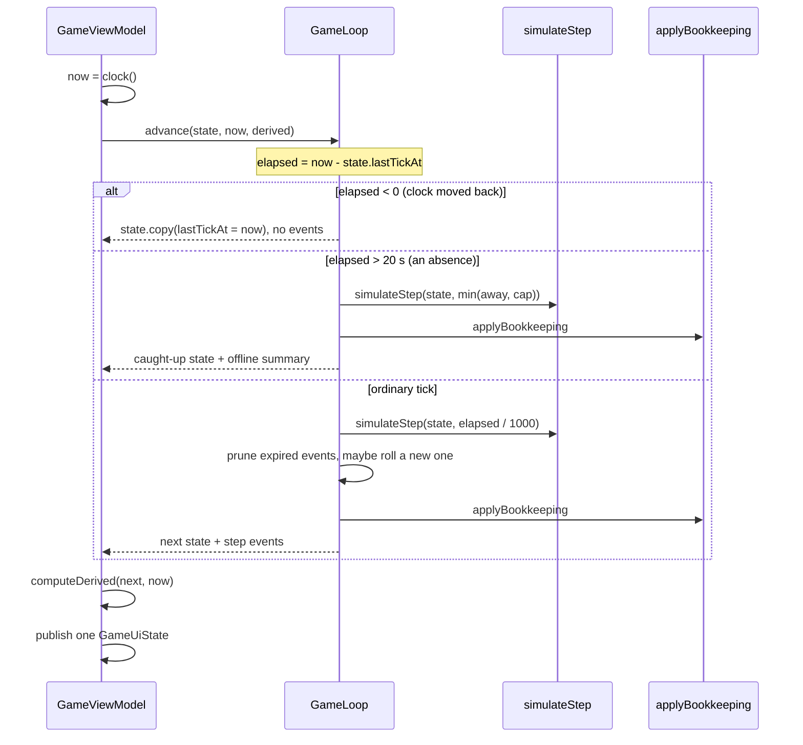

# Game engine

[← Documentation home](Home.md)

Two layers, deliberately separated.

| | File | Responsibility |
| :-- | :-- | :-- |
| **The physics** | `domain/engine/Simulation.kt` | `simulateStep(state, dt)` — gases, resources, temperature, habitability. Pure, deterministic, step-size independent. |
| **The rules of a session** | `domain/engine/GameLoop.kt` | Whether a gap counts as an absence, rolling events, firing headlines, awarding achievements, settling challenges, purchasing, prestige. |

Neither knows about Android, and neither reads a clock. `nowMs` is always a parameter.

## Why the split

`simulateStep` is the part that has to be *provably* the same whether it runs 14,400 times or
once, because that property is what makes [offline progression](Offline-Progression.md) a single
calculation. Keeping bookkeeping out of it is what keeps that provable: an achievement check
inside the integration would fire a different number of times depending on step size.

`GameLoop` is everything a *session* needs on top. It lives in `domain/` rather than in the
ViewModel so that "a night away fires the same headlines a live session would have" is a JVM
test rather than an instrumented one.

## Data flow of one tick



## `advance(state, nowMs, derived)`

The single entry point the ViewModel calls, four times a second and once on return from the
background. It branches three ways on elapsed time:

| Elapsed | Path |
| :-- | :-- |
| `== 0` | Nothing. The state is returned by identity, and the ViewModel skips the publish. |
| `< 0` | **Re-anchor.** Nothing is simulated — no resource is un-produced — but `lastTickAt` is set to `nowMs`. Without this a backwards clock freezes the game until the wall clock catches back up. See [Offline progression](Offline-Progression.md#clock-anomalies). |
| `> SIMULATION.OFFLINE_GAP_THRESHOLD_MS` (20 s) | **Absence.** Settled through `computeOfflineProgress`, reported so the UI can show a welcome-back summary. |
| otherwise | **Ordinary tick.** One `simulateStep`, then event pruning and a possible event roll. |

Random events are rolled **only on the live path**. An absence deliberately produces none: an
event is a short multiplier swing the player could have reacted to, and awarding a handful for
a night asleep would be noise. `OfflineLifecycleTest` asserts it.

## `applyBookkeeping(previous, input, nowMs)`

Runs on **both** paths, in this order:

1. **Settle the active challenge.** A broken restriction fails it immediately; a met goal
   completes it and banks its permanent reward.
2. **Fire milestone headlines.** Newly-true milestones are recorded in `milestonesTriggered`
   and prepended to `newsFeed`, newest first, capped at `NEWS_FEED_LIMIT` (40).
3. **Award achievements.** Anything newly true is added to `achievementsUnlocked`.

`justCollapsed` is computed as `!previous.collapsed && state.collapsed`, which is why the
*previous* state is a parameter — it is the only way to tell "the planet is dead" from "the
planet just died", and one achievement and one haptic depend on the difference.

## `DerivedState` and `computeDerived`

```kotlin
data class DerivedState(
    val civLevel: Int,
    val prestige: PrestigeMultipliers,
    val effective: EffectiveMultipliers,
    val productionRates: ProductionRates,
    val disabledTechIds: Set<String>,
)
```

Everything expensive that both the tick and the UI need, computed **once per state change**
rather than per frame. Folding the technology tree's multipliers and summing production rates
is the most expensive thing the game does outside the tick, and a single Compose screen can
read `productionRates` dozens of times in one recomposition.

`computeDerived(state, nowMs)` takes `nowMs` only because active-event multipliers expire on a
wall clock.

## Actions on `GameLoop`

Every one takes a state and returns a state. None mutates anything.

| Method | Notes |
| :-- | :-- |
| `purchase(state, techId, quantity, derived)` | Delegates to `purchaseTechnology`, counts the purchase, and reports the highest [ownership threshold](Economy-and-Production.md#ownership-bonuses) crossed. Atomic: either the affordable quantity is bought and paid for, or nothing changes. |
| `buyPrestigeUpgrade(state, upgradeId)` | Refuses silently past `maxLevel` or below the cost. |
| `scoreRun(state, nowMs, derived)` | The payout and summary for a finished run, **without** applying the reset. The collapse dialog shows this. |
| `resetEarth(state, nowMs, derived)` | Requires `state.collapsed`. Banks points, starts a fresh Earth, applies every "starting" prestige bonus, awards reset achievements. |
| `startChallenge(state, id, nowMs)` | Abandons the current Earth for a fresh one with the restriction armed. |
| `abandonChallenge(state)` | Clears `activeId`. Completions already banked are kept. |
| `updateSettings` / `advanceTutorial` / `skipTutorial` | Straight field updates, here so the ViewModel holds no game rules. |

## Determinism

`GameLoop` takes a `Random` in its constructor rather than reaching for a global:

```kotlin
class GameLoop(private val random: Random = Random.Default)
```

Seed it and the same sequence of events happens every time — which is what
`GameLoopTest.event rolls are reproducible for a given seed` asserts, and what lets
[`EventsParityTest`](Reference-Parity.md) compare a roll against the reference engine's.

`simulateStep` has no randomness at all.

---

**Next:** [Game state](Game-State.md) · [Simulation](Simulation.md) · [Offline progression](Offline-Progression.md)
