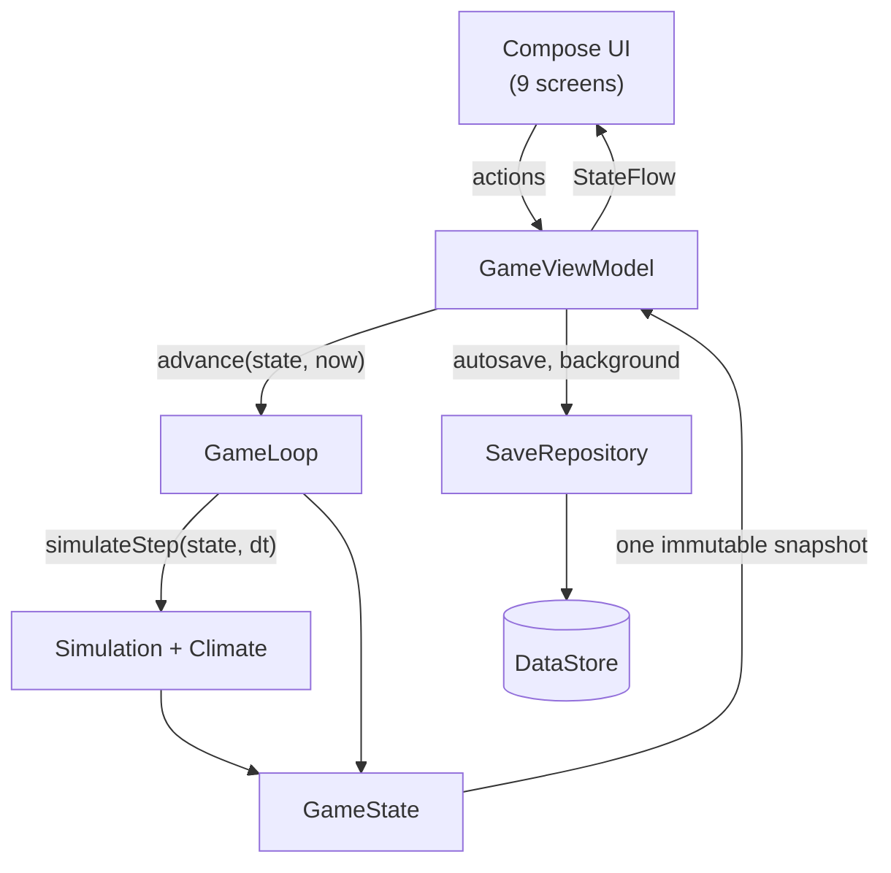

# EARTH — Technical Documentation

The developer and contributor documentation for **EARTH**, a native Kotlin/Jetpack Compose
idle game for Android. For the player-facing introduction, start at the
[repository README](../../README.md).

> [!IMPORTANT]
> **`docs/wiki/` is the canonical technical documentation.** The GitHub Wiki tab is enabled on
> this repository but has never been populated, and nothing in this directory has been copied
> there. Page names are chosen so the whole directory can be pushed to the wiki repository
> unchanged if that is ever wanted — see [Documentation maintenance](#documentation-maintenance).

---

## Start here

| | |
| :-- | :-- |
| **[Developer overview](../DEVELOPER_OVERVIEW.md)** | The 5-minute orientation: what the project is, where everything lives, how to build and test it |
| **[Architecture](Architecture.md)** | The four layers, the dependency rules, and what is forbidden where |
| **[Contributing](Contributing.md)** | Conventions, requirements, and the things a first change gets wrong |
| **[Codebase audit](../CODEBASE_AUDIT.md)** | What was found, what was fixed, what is still outstanding |

## The game engine

Pure Kotlin, no Android. This is where the game actually is.

| | |
| :-- | :-- |
| [Game engine](Game-Engine.md) | `simulateStep`, `GameLoop`, and how a tick flows through them |
| [Game state](Game-State.md) | Every field of `GameState` and who owns it |
| [GameDecimal](GameDecimal.md) | The arbitrary-scale number type, and why `Double` is not enough |
| [Simulation](Simulation.md) | Production rates, multiplier folding, the per-tick order of operations |
| [Climate model](Climate-Model.md) | Gases, forcing, temperature, sea level, habitability — every formula |
| [Economy and production](Economy-and-Production.md) | Pricing, the price-stability invariant, buy-max, ownership bonuses |
| [Technology system](Technology-System.md) | The 99-node tree, tiers, the scaling curves, choice groups |
| [Prestige system](Prestige-System.md) | Earth Points, the payout formula, the 11 permanent upgrades |
| [Achievements and challenges](Achievements-and-Challenges.md) | 32 achievements, 8 challenges, how each is checked |
| [Random events](Random-Events.md) | 13 events, eligibility, weighted rolls, and the milestone news feed |
| [Offline progression](Offline-Progression.md) | Absences, the cap, clock anomalies, the lifecycle that drives it |

## Persistence

| | |
| :-- | :-- |
| [Save system](Save-System.md) | Format, the two slots, corruption recovery, where Android keeps it |
| [Save migrations](Save-Migrations.md) | The version chain, and how to add a version safely |

## Android and UI

| | |
| :-- | :-- |
| [UI architecture](UI-Architecture.md) | ViewModel, `StateFlow`, recomposition, the nine screens |
| [Navigation](Navigation.md) | The explicit destination stack, and why not `NavHost` |
| [Android platform](Android-Platform.md) | Manifest, SDK levels, lifecycle, permissions, backup |
| [Audio and haptics](Audio-and-Haptics.md) | The platform adapters, and the state the audio layer is in |
| [Advertising](Advertising.md) | The one banner, consent, and what is deliberately absent |
| [Accessibility](Accessibility.md) | Semantics, touch targets, font scaling, reduced motion |

## Release and distribution

| | |
| :-- | :-- |
| [Release process](Release-Process.md) | Versioning, signing, artifacts, the checklist |
| **[Release signing](../RELEASE-SIGNING.md)** | Creating, protecting and backing up the release key; building and verifying the signed APK |
| **[GitHub release template](../GITHUB_RELEASE_TEMPLATE.md)** | The release page to copy, with installation instructions for players |
| [Google Play](Google-Play.md) | A future option, not this release. What the build already satisfies and what Play Console would need |
| [Licensing](Licensing.md) | The project's licence, the dependencies', the artwork's |
| [Privacy](Privacy.md) | Consent architecture, player controls, keeping the policy true |
| **[Release blockers](../RELEASE_BLOCKERS.md)** | Everything outstanding, split into technical blockers and owner requirements |
| [Assets](../ASSETS.md) | Every shipped non-code asset and what is known about its provenance |

| Working document | |
| :-- | :-- |
| [Privacy policy](../PRIVACY_POLICY.md) | The published policy |
| [Third-party licences](../THIRD_PARTY_LICENSES.md) | The dependency audit |
| [Google Play Data Safety](../GOOGLE_PLAY_DATA_SAFETY.md) | Prepared answers for the form |
| [Google Play release checklist](../GOOGLE_PLAY_RELEASE_CHECKLIST.md) | Item by item, with evidence |
| [Production QA checklist](../PRODUCTION_QA_CHECKLIST.md) | What to walk on a device before publishing |
| **[Final device QA](../FINAL_DEVICE_QA.md)** | The one pass no build can do for you — 43 steps on real hardware |
| [Release notes template](../RELEASE_NOTES_TEMPLATE.md) | Drafts for the GitHub release and Play's "What's new" |

## Engineering

| | |
| :-- | :-- |
| [Testing](Testing.md) | The suites, how to run them, how to add cases |
| [Reference parity](Reference-Parity.md) | The TypeScript oracle, the fixtures, and the contract between them |
| [Build system](Build-System.md) | Toolchain, Gradle layout, variants, R8, CI |
| [Performance](Performance.md) | Where the time goes, what was measured, how to measure again |
| [Security and privacy](Security-and-Privacy.md) | Threat surface, permissions, what leaves the device (almost nothing) |

## Reference

| | |
| :-- | :-- |
| [FAQ](FAQ.md) | Player questions, in plain language |
| [Glossary](Glossary.md) | Every term the codebase and the game use |
| [Troubleshooting](Troubleshooting.md) | Build failures, test failures, device problems |

---

## The 60-second version



- **`GameState` is immutable.** Every transition takes one and returns the next.
- **`simulateStep(state, dt)` is pure and deterministic.** No clock, no I/O, no Android.
- **The live path and the offline path are the same code.** A 250 ms tick and an 8-hour
  catch-up call the same function; the gas integration is closed-form, so they agree exactly.
- **`domain/` has no Android dependency at all.** That is enforced socially, documented in
  [Architecture](Architecture.md), and is the reason 220 tests run on the JVM in seconds.

---

## Documentation maintenance

**The code is the source of truth.** These pages quote constants, counts and formulas from it,
and every one of them was read out of the source rather than remembered.

Update the relevant page in the same change that touches the code:

| When you change… | Update… |
| :-- | :-- |
| `GameState` or any persisted field | [Game state](Game-State.md), [Save system](Save-System.md) |
| The save format or `SAVE_VERSION` | [Save system](Save-System.md), [Save migrations](Save-Migrations.md) |
| Simulation or climate formulas | [Simulation](Simulation.md), [Climate model](Climate-Model.md) |
| `Constants.kt` / `BALANCE` | [Economy and production](Economy-and-Production.md), [Technology system](Technology-System.md) |
| The technology tree (count, tiers, requirements) | [Technology system](Technology-System.md), README feature table |
| Achievements, challenges, events, milestones | [Achievements and challenges](Achievements-and-Challenges.md), [Random events](Random-Events.md), README feature table |
| Layer boundaries or dependency direction | [Architecture](Architecture.md) |
| The Gradle build, dependencies or variants | [Build system](Build-System.md) |
| Manifest, permissions, SDK levels, lifecycle | [Android platform](Android-Platform.md), [Security and privacy](Security-and-Privacy.md), [Privacy](Privacy.md) |
| A dependency added, removed or upgraded | `python3 scripts/third-party-notices.py`, then [Third-party licences](../THIRD_PARTY_LICENSES.md) and [Data safety](../GOOGLE_PLAY_DATA_SAFETY.md) |
| Ads or the consent flow | [Advertising](Advertising.md), [Privacy](Privacy.md), [Privacy policy](../PRIVACY_POLICY.md) |
| Anything a player sees or feels | [FAQ](FAQ.md), README |

**A count in prose is a claim.** If you add a technology, the "99 technologies" in the README
and in [Technology system](Technology-System.md) is now wrong. `ContentParityTest` will catch
the parity fixtures being stale; it will not catch a stale sentence.

One thing *is* automated. Every relative link and `#anchor` in every Markdown file in the
repository is checked on each CI run, and locally by:

```bash
python3 scripts/check-docs-links.py
```

Dependency-free — Python 3 and nothing else — deliberately, so it stays cheap enough that nobody
turns it off. It does not check external URLs: a link checker that fails because someone else's
site is down is a link checker people disable.

### Pushing this to the GitHub Wiki

Every page here is plain GitHub-Flavored Markdown with relative links, and the filenames are
already in the wiki's `Page-Name.md` convention with a `Home.md` entry point. To mirror it:

```bash
git clone https://github.com/themantas1994/Earth-idle-game.wiki.git
cp docs/wiki/*.md Earth-idle-game.wiki/
cd Earth-idle-game.wiki && git add . && git commit -m "Sync from docs/wiki" && git push
```

Relative links between pages resolve in both places. Links that reach *outside* `docs/wiki/`
(such as `../CODEBASE_AUDIT.md`) will not resolve in the wiki — that is the cost of the mirror,
and the reason `docs/wiki/` stays canonical rather than the copy.
