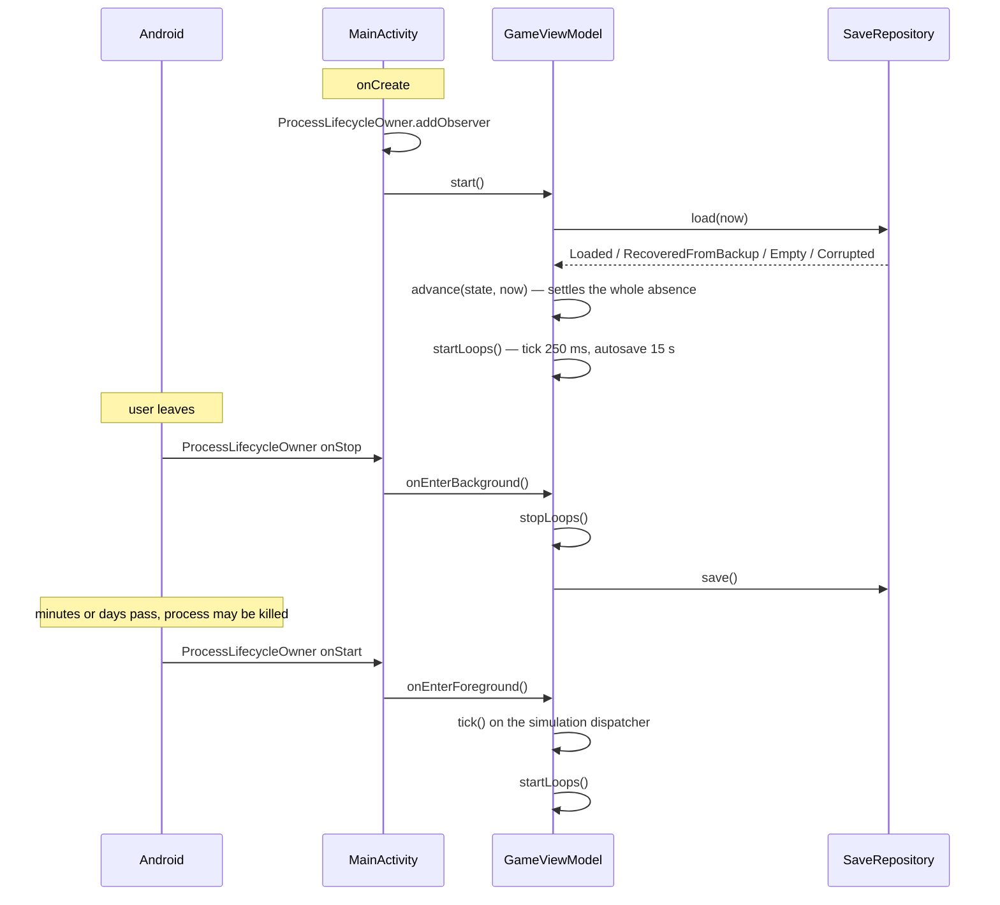

# Offline progression

[← Documentation home](Home.md)

Idle progression is the core feature. It is implemented with **arithmetic, not a background
service** — there is no service, no `WorkManager`, no `AlarmManager` and no wake lock anywhere in
the app.

## How it works

`GameState.lastTickAt` is the whole mechanism. On return, the elapsed wall-clock time is computed,
clamped to the cap, and handed to `simulateStep` as a **single** `dt`.

That is correct rather than approximate because the gas integration is
[closed-form](Climate-Model.md#gas-integration): one call with `dt = 8 hours` produces the same
numbers as 115,200 calls with `dt = 250 ms`. `OfflineParityTest.offline catch-up equals having
played the same time live` asserts it directly.

```kotlin
fun computeOfflineProgress(state, nowMs, prestige, offlineProgressEnabled): OfflineProgressResult {
    val awaySeconds = max(0.0, (nowMs - state.lastTickAt) / 1000.0)
    val cap = SIMULATION.BASE_OFFLINE_CAP_SECONDS * prestige.offlineCapMultiplier

    if (!offlineProgressEnabled || awaySeconds <= 0) {
        return /* … */ state.copy(lastTickAt = nowMs) /* … */
    }

    val simulatedSeconds = min(awaySeconds, cap)
    val stepped = simulateStep(state, simulatedSeconds, prestige).state
    return /* … */ stepped.copy(lastTickAt = nowMs) /* … */
}
```

**`lastTickAt` always advances to `nowMs`, even when nothing is simulated.** Otherwise a player
with offline progress switched off would bank the entire accumulated absence the moment they
switched it back on. `OfflineParityTest.the clock always advances, even when nothing is simulated`
guards it.

## The planet ages while you are away

Because the whole absence goes through `simulateStep`, the Earth's
[simulated age](Atmospheric-Half-Life.md#the-two-clocks) advances with it — and so does the
[half-life decay](Atmospheric-Half-Life.md) that runs on that age. Three consequences:

- **`simulatedSeconds`, not `awaySeconds`, is what ages the planet.** An absence past the cap
  ages the Earth by the cap. A player with offline progress switched off comes back to a planet
  that has not aged at all, with its atmosphere exactly as they left it.
- **Gas can go down while you are away.** At 86,400 simulated seconds per real second, CO₂'s
  120-year half-life is 12.2 real hours — about one offline cap. An Earth left overnight with
  nothing emitting comes back with roughly half its excess CO₂ gone. This is the intended
  pressure, and the welcome-back summary names the elapsed simulated age so the number is
  explicable rather than alarming.
- **It still costs one calculation.** Decay is resolved inside the same closed-form step as
  production, so ageing an eight-hour absence is not a loop and cannot drift from live play.
  `GameAgeTest.offline and live play age the Earth and its atmosphere identically` asserts both
  halves at once.

## The cap

| | |
| :-- | :-- |
| `BASE_OFFLINE_CAP_SECONDS` | **12 hours** — so a night's sleep is fully banked |
| Extended Endurance ×3 | ×8 |
| Automated Industry | ×2 |
| **Maximum** | **×16 = 8 days** |

Twelve hours is chosen so that coming back to a stockpile big enough to buy a dozen things at once
is the normal experience, because that is the loop the game is built around.

The cap is **per absence, not per day**: two eight-hour absences bank two eight-hour absences.
Only a *single* gap longer than the cap is truncated, and `cappedByLimit` is reported so the
summary can say so.

## The weather runs while you are away

Storms are **simulated across the elapsed time**, not frozen and not skipped.
`computeOfflineProgress` settles an absence in two passes:

1. The storms that were **already running** when the player left are priced,
   averaged across the window over their own intensity curves — the analytic
   settlement an absence gets instead of a replayed frame loop. Production then
   runs with that penalty folded in.
2. Only then does the storm timeline advance, through the same fixed 5-second
   steps a live session would have run. A storm can therefore form, intensify,
   move across the globe and dissipate entirely while the app was closed, and the
   welcome-back summary reports how many formed and how many are still running.

A storm that forms *during* an absence costs nothing until the player is back. It
is on the board when they return, doing exactly what the simulation says it
should be, but the time they were not there is not billed to them — the same
bargain the random events below already make.

That also means **a player who left under clear skies is settled bit-for-bit as
they were before storms existed**, which is what keeps this function numerically
identical to the one the parity fixtures were captured from.
`StormLifecycleTest` asserts both halves of it.

See [Storm system](Storm-System.md#offline-behaviour) for the mechanism.

---

## What a player is *not* given

Purchases. Offline progress is exactly "what your civilization produced while nobody was
choosing", which is production, accumulation and the climate consequences — never the technologies
you would have bought with it. That is the whole reason to come back.

Random events are also not rolled offline; see [Random events](Random-Events.md).

## The lifecycle



**`ProcessLifecycleOwner`, not the activity's lifecycle.** A configuration change destroys and
recreates the activity, and treating that as "the player left" would save and re-settle an absence
on every rotation. Process lifecycle fires only when the app as a whole backgrounds, which is both
the last reliable chance to write the save and the moment offline progress starts accruing.

**Both loops stop on background.** The tick has nothing to render, and the autosave has nothing new
to write — leaving it running would rewrite an unchanging save every fifteen seconds for as long as
the app sits in the background.

**The catch-up runs on the simulation dispatcher**, not the main thread, like every other
simulation step.

## The three ways a session resumes

| | What happens |
| :-- | :-- |
| **Backgrounded, process alive** | `onEnterForeground` → one `tick()` → `advance` sees a gap > 20 s and takes the offline path. |
| **Process killed, cold start** | `start()` loads the save, whose `lastTickAt` is from the last write, and `advance` settles from there. Identical to the above — `OfflineLifecycleTest.a cold start after process death is the same as a backgrounded resume` asserts the two produce the same state. |
| **First ever launch** | `createNewGame(now)` has `lastTickAt == now`, so elapsed is 0 and nothing is banked. |

Note the consequence of the second row: the absence is measured from the **last successful save**,
not from when the process died. That is why `onEnterBackground` saves before stopping anything,
and why autosave runs every 15 seconds while playing.

## Clock anomalies

The device clock is not monotonic. Users change it, time zones shift, NTP corrects it.

| Situation | Behaviour |
| :-- | :-- |
| **Clock moves backwards** | `advance` **re-anchors**: `lastTickAt = nowMs`, nothing simulated. No resource is un-produced and no gas un-emitted — but the game keeps running. Without the re-anchor the game freezes until the wall clock catches back up, which for a one-hour correction means an hour of watching a dead planet. |
| **`lastTickAt` in the future** (a save written under a fast clock) | Same path. Settles to an ordinary tick, no summary. |
| **Absurd elapsed time** (a save from 2024 opened in 2100) | The cap makes it ordinary. The raw elapsed value still has to survive the arithmetic, and `OfflineLifecycleTest.an absurd elapsed time cannot overflow the simulation` checks temperature, resources and habitability all stay finite and in range. |
| **Missing timestamp** | The decoder falls back to the load-time clock, so a save with no `lastTickAt` banks nothing rather than banking since the epoch. |
| **Clock moved forward** | Indistinguishable from time actually passing, and treated as such. The cap bounds what it is worth. This is not defended against — see below. |

> **On clock exploits.** Jumping the clock forward grants up to one capped absence, and there is no
> server to check against. This is a single-player offline idle game with no leaderboard and no
> competitive surface, so the cost of "defending" it (a monotonic elapsed-time source that then
> mis-measures real absences across reboots) is far higher than the cost of the exploit. It is a
> deliberate non-goal, not an oversight.

## The summary

```kotlin
data class OfflineProgressResult(
    val awaySeconds: Double,          // real elapsed
    val simulatedSeconds: Double,     // min(away, cap)
    val cappedByLimit: Boolean,
    val offlineCapSeconds: Double,
    val state: GameState,
    val summary: OfflineProgressSummary,   // gas produced, resources gained, temperature before/after
)
```

The gains are computed by **subtracting the before-state from the after-state**, which is only
possible because `GameState` is immutable — and means the summary can never disagree with what was
actually applied.

An absence is reported unless `simulatedSeconds <= MIN_REPORTABLE_ABSENCE_SECONDS` (5). In practice
that only suppresses the summary for a player who has offline progress switched off, since the
20-second gap threshold is already well clear of the floor.

## Testing

| Test | Covers |
| :-- | :-- |
| `OfflineParityTest` | Absences from 0 to a week against the reference, with and without cap upgrades, enabled and disabled; the cap; catch-up equalling live play |
| `OfflineLifecycleTest` (18 cases) | Gap granularity, the cap and repeat absences, backwards clocks, future timestamps, missing timestamps, absurd elapsed time, cold start after process death, first launch, opting out, challenges surviving an absence, no events rolled, expired events pruned |
| `GameViewModelTest` | Backgrounding saves, returning settles, the tick loop stops while backgrounded, an over-cap absence banks only the cap |
| `SimulationParityTest` | Step-size independence — the property the whole design rests on |

---

**Next:** [Save system](Save-System.md) · [Android platform](Android-Platform.md) · [Game engine](Game-Engine.md)
