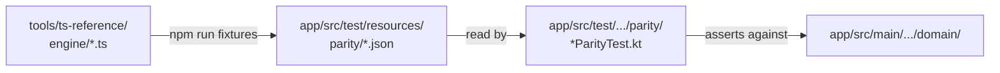

# Reference parity

[← Documentation home](Home.md)

`tools/ts-reference/` holds the original TypeScript engine from the web build. **It is not part of
the app and nothing in the build depends on it.** It exists as the **parity oracle**: the thing that
decides whether the Kotlin port's answers are right.

## The contract

> The Kotlin engine and the TypeScript engine must produce the same numbers for the same inputs,
> within documented floating-point tolerances.

Not "the port looks like a faithful translation" — **the port's answers were compared against the
reference's actual output.** The reference was executed, its results captured as JSON, and the
Kotlin suite asserts against those.



The fixtures are **committed**, so `./gradlew test` needs no Node toolchain and CI does not install
one. The reference is only needed to *regenerate* them.

## The fixtures

`app/src/test/resources/parity/`, marked `linguist-generated` in `.gitattributes` so they stay out
of diffs and reviews.

| File | What it pins down |
| :-- | :-- |
| `decimal.json` | 24 operands from 1e-400 to 1e1000: every unary op, all 576 binary pairs, 104 `pow` cases, the save-triple round trip |
| `format.json` | 36 values × 4 notations × 2 precisions, plus durations, temperatures and percentages — compared as **strings** |
| `technologies.json` | All 99 technologies, every field, plus the tier curves at 45 tiers |
| `economy.json` | Quoted and bulk prices, buy-max affordability including the exact geometric-series boundary, the prestige discount, the ownership ladder |
| `climate.json` | 3,240 gas integrations across every gas × production rate × removal state × sink efficiency × step size from 250 ms to a day; forcing, temperature, ocean chemistry, all five habitability factors |
| `prestige.json` | The upgrade table and cost ladders, nine ownership combinations including everything maxed, the speed term, payouts for gas totals from 0 to 1e120 |
| `content.json` | The achievement, challenge, event, milestone, gas and resource tables — including each challenge's **computed** technology lockout set |
| `events.json` | Every eligibility state × draw, so a seeded roll picks the same event |
| `simulation.json` | A **95-step scripted playthrough** from a fresh game to collapse and through a prestige reset, comparing every simulation value at every step |
| `stepIndependence.json` | One hour in one step versus 14,400 quarter-second ticks |
| `offline.json` | Absences from 0 to a week, with and without the cap upgrades, enabled and disabled |
| `save.json` | Saves the reference actually wrote, plus the v1→v2→v3 migration results |

## Regenerating

```bash
cd tools/ts-reference
npm install
npx vitest run       # the reference's own 198 tests — run these first
npm run fixtures     # rewrites app/src/test/resources/parity/*.json
cd ../.. && ./gradlew test
```

Generation is deterministic: regenerating without changing the reference produces byte-identical
files. **That is a feature — use it.** After a change, `git diff --stat app/src/test/resources/parity/`
should show *only* the files you expected to move. If something else changed, you coupled two
systems you did not mean to.

## Changing shared maths

Any change to a formula, constant, price, growth rate, technology, achievement, challenge, event or
headline is a **change to both engines**:

1. Change `app/src/main/java/com/earthgame/idle/domain/…`
2. Change `tools/ts-reference/engine/…` identically
3. `cd tools/ts-reference && npx vitest run && npm run fixtures`
4. `./gradlew test`
5. Review the fixture diff
6. Update the affected wiki page

Skipping step 2 fails the parity tests immediately, which is the point.

## Deliberate differences

Two, both narrow, both documented where they live.

**The Speedrun challenge** used `Date.now() - state.runStartedAt` inside its goal check, which made
a pure predicate depend on a wall clock: the same state could give different answers on consecutive
calls, and it could not be tested at all. It now measures from `state.lastTickAt`, which the tick
sets to the current time on every step. Behaviour in a live game is identical to within one tick.

**Water vapour lags one simulation step.** It is a feedback driven by the *previous* step's
temperature rather than an accumulating stock, so unlike every other gas it is not step-size
independent: one 3,600-second call sees a temperature of zero throughout where 14,400
quarter-second calls do not. **This matches the reference exactly** — its own step-size test
likewise checks only the accumulating quantities — and nothing the player spends or is scored on
depends on it: H₂O emits nothing, is never banked, and contributes forcing only through a
temperature the other gases already set.

Everything else — every formula, constant, threshold, price, growth rate, technology, achievement,
challenge, event and headline — is unchanged.

## Two shared bugs fixed in both engines

Parity means shared bugs are shared. Two were found in this audit and fixed in **both** engines with
the fixtures regenerated, so parity holds:

- **Ambiguous compact number suffixes.** The alphabetic fallback past `Vg` (1e63) started at one
  letter, so 1e69 printed as `1B` — indistinguishable from 1e9 — and 1e96 as `1K`. Both magnitudes
  occur in the same run. The fallback now starts at two letters (`AA`, `AB`, …), which cannot collide
  with any named suffix. `format.json` changed.
- **Two challenge reward descriptions that did not match their effects.** See
  [Achievements and challenges](Achievements-and-Challenges.md#known-copy-discrepancies).
  `content.json` changed.

Fixing the oracle is legitimate — and preferable to letting the port diverge from it — but it is a
**deliberate act**, and this is the list of times it has been done.

## Should the reference be kept?

Yes, and this is worth being explicit about because "the port is finished, delete the old code" is a
tempting instinct.

The reference is not dead code. It is the **only** independent implementation of the game's maths,
and it is what makes a claim like "3,240 gas integrations agree" possible. Delete it and every
future formula change is verified by re-reading the diff, which is exactly the verification method
the parity suite exists to replace.

It costs 24 TypeScript files that nothing builds, nothing ships and nothing depends on. Keep it
until something stronger replaces it.

`npm install` is only needed to regenerate; the committed fixtures carry the whole contract.

---

**Next:** [Testing](Testing.md) · [Climate model](Climate-Model.md) · [Contributing](Contributing.md)
