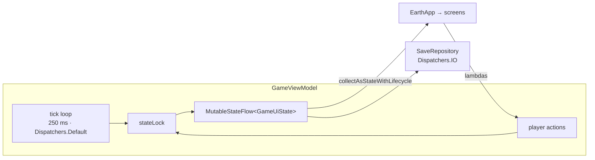

# UI architecture

[← Documentation home](Home.md)

Jetpack Compose with Material 3. No XML layouts, no Fragments, no `View` hierarchy except the ad
banner (which is a real `AdView` and has to be).

## One state, one flow



`GameUiState` is the single snapshot every screen reads: the `GameState`, the
[`DerivedState`](Game-Engine.md#derivedstate-and-computederived), a `loaded` flag, and the
transient slots for the offline summary, the collapse summary, four toasts and the two save
warnings.

`MainActivity` collects it with `collectAsStateWithLifecycle`, so collection stops when the
activity is not started.

## Threading

The tick runs on **`Dispatchers.Default`, never the main thread**. A late-game step walks the whole
technology tree and does a few thousand arbitrary-precision operations; at four ticks a second on
the main thread that is a dropped frame every 250 ms. Saving runs on IO inside the repository. The
main thread only ever reads the finished `StateFlow`.

That means **two threads produce state**: the tick, and the player tapping Buy.

> [!IMPORTANT]
> Every transition is a **read-compute-write under `stateLock`**, not a bare
> `MutableStateFlow.update`. The compute step reads the current state, and a purchase settled
> against a snapshot the tick has since replaced would silently undo itself — the technology
> un-bought and the resources refunded.
>
> The helper is `mutate { current -> Transition(next, carried) }`. Side effects — haptics, audio,
> saving — deliberately happen **outside** the lock, on whatever the transition carried out. The
> critical section is a single tick's worth of work, so the main thread is never held up for a
> visible frame.
>
> `GameViewModelConcurrencyTest.aTickLandingInsideAPurchaseIsSerializedNotLost` forces the exact
> interleaving through a clock that blocks inside the purchase's critical section, and records
> every published state so a *transient* rollback cannot be repaired by a later tick before the
> assertion sees it. It fails against an unsynchronized implementation.

## Recomposition and stability

`GameState` changes identity every tick, so the screen genuinely does recompose four times a
second — that is inherent to an idle game where most displayed numbers change every tick.

What is *not* inherent is a composable being unable to skip when its inputs are unchanged. Compose
infers stability from a type's fields, and `GameState` holds `Map`/`List` (interfaces, so
unknowable) while the amount containers hold a private array — all inferred **unstable**.

Annotating them `@Immutable` would mean adding `androidx.compose.runtime` as a dependency of
`domain/`, which is exactly the [layering rule](Architecture.md) the project is built on. So
stability is declared from the outside instead:

```kotlin
// app/build.gradle.kts
composeCompiler {
    stabilityConfigurationFiles.add(layout.projectDirectory.file("compose-stability.conf"))
}
```

`app/compose-stability.conf` lists the domain value types. Measured effect (from the Compose
compiler's own reports): **effectively-stable classes 43 → 68**, and **28 more arguments compared
by value rather than by reference identity**. The skippable-composable count is unchanged at 152 of
201, because strong skipping is already on by default in Kotlin 2.x — the gain is that equal-valued
arguments now actually compare equal.

To re-measure:

```bash
./gradlew assembleDebug -Pearth.composeReports=true
cat app/build/compose-reports/debug/app-module.json
```

Other recomposition discipline in the codebase:

- Expensive per-card work is memoised: `TechCard` wraps `maxAffordableQuantity` in
  `remember(tech.id, owned, state.resources, discount, cappedQuantity, locked)`.
- Long lists are `LazyColumn` with stable `key = { it.id }`.
- The most expensive shared computation, `DerivedState`, is computed **once per state change** in
  the ViewModel rather than per composable.
- No blocking work happens in a composable. The only I/O is in the repository, on IO.

## The nine screens

| Destination | Shows |
| :-- | :-- |
| 🌍 **Home** | Next objective (and the right tab for it), planetary status, economy, momentum, emitting gases, the news feed, the Reset button |
| ☁️ **Atmosphere** | Per-gas concentration, production, engineered removal, natural lifetime, heating contribution; total radiative forcing |
| 🔬 **Technology** | The 31 research nodes, filterable by branch |
| 🏭 **Production** | The 68 generators, with a ×1/×10/×100/Max selector |
| ✨ **Prestige** | Earth Points and the 11 permanent upgrades |
| 🎯 **Challenges** | The active challenge and its goal; the 8 available, with rewards |
| 🏆 **Achievements** | All 32, locked and unlocked |
| 📊 **Statistics** | Lifetime stats, climate records, total gas produced |
| ⚙️ **Settings** | Number format, theme, reduced animations, sound, music, vibration, confirm-reset, offline progress, advertising privacy, About |

Two further destinations sit outside the tab bar, reached from Settings:

| Destination | Shows |
| :-- | :-- |
| ℹ️ **About** | Version, version code, package, the project's licence, the third-party notices, the privacy policy, advertising privacy, the repository link |
| 📄 **Open Source Licenses** | `THIRD_PARTY_NOTICES.txt`, read from the app's assets off the main thread and rendered a paragraph at a time |

The header is persistent: which Earth this is, temperature, habitability, status — and, on every
tab but Home, the resource balances, because every other tab asks the player to spend and having
them only on Home meant bouncing back and forth to answer "can I afford this yet?".

Its background tint tracks `VisualEra` (`PRISTINE` < 0.5 °C, `INDUSTRIAL` < 3, `HOT` < 15,
`EXTREME`, `COLLAPSED`), so a run reads as a slow slide from green to burning red without the
player having to watch a number.

## Dialogs and toasts

Dialogs, in precedence order: save warning → offline summary → collapse summary → uninhabitable →
confirm reset.

Toasts float **over** the content rather than displacing it, so a headline arriving mid-purchase
never moves the button out from under a thumb. Four kinds: achievement, milestone, event,
ownership threshold.

## Adaptive layout

`WindowWidthSizeClass` decides. On `Compact` it is the portrait column the game was designed for.
On anything wider the navigation moves to a left rail and the content column is capped at
**640 dp** and centred, so the extra width becomes margin rather than absurdly long stat rows.

## Theme

`presentation/theme/Theme.kt`. Material 3's colour scheme covers buttons, surfaces and the ripple,
but the game needs semantic colours Material has no opinion about — the six gas colours,
good/warning/danger for habitability, and the dim/faint text steps the dense stat rows are built
on. Those live in one `GameColors` object provided through a `CompositionLocal`, carried over from
the original build's CSS tokens.

Light and dark palettes both exist; the light accent is a darker teal because the dark one washes
out on white. `ThemePreference` is `SYSTEM`, `LIGHT` or `DARK`.

`LocalReducedAnimations` is read by every animated surface, so the accessibility setting is
honoured everywhere rather than in the two places someone remembered.

## Testing

`EarthAppScreenTest` (12 cases) runs the **whole Compose UI under Robolectric** as part of
`./gradlew test` — every destination rendering, Back unwinding the screen history, a purchase
reaching the game, the two shopping lists staying disjoint, every Settings toggle, the reset button
staying inert until the Earth is dead, the tutorial not blocking, light theme, and the wide-window
side rail. `EarthAppUiTest` mirrors a subset for a real device.

---

**Next:** [Navigation](Navigation.md) · [Accessibility](Accessibility.md) · [Performance](Performance.md)
